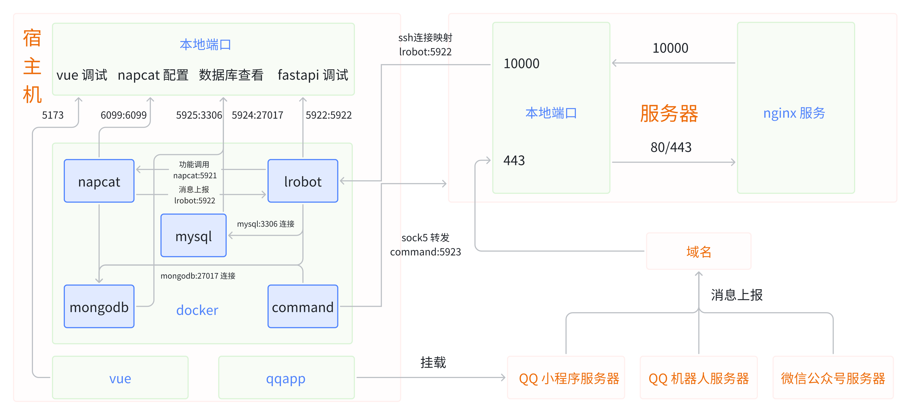

# LRobot

---

## ***LR232*** & ***LR5921***

    
    
    

**鸣谢:**   
> &nbsp;  &nbsp;  &nbsp;  &nbsp;  &nbsp;  &nbsp;

---

**本项目仅作为学习研究使用，切勿用于非法用途**

---

[项目文档](https://wwweibu.github.io/Lrobot/)
## 项目优点
- 多平台接入：一套代码同时支持 QQ 官方机器人、Napcat、微信、B 站、QQ 小程序、网页
- 统一消息标准：自动封装并转换不同平台消息格式，简化多端开发难度
- 模块化架构：功能按需加载，支持动态热更新与快速扩展
- 开箱即用的教程：从零到部署，初学者也能跟着完成
- 开放接口：便于二次开发与功能自定义

---

## 写在前面
- 本项目其实就是一个消息处理器，将各平台的各种标准统一处理。整体没有什么复杂度
- 但看文档还是比较费时的，故将各种文档中的信息整理一下，写了一些平台的配置教程，装作自己干了很多事罢了
- 所谓的多平台，就是把每种不同的标准包起来，丢掉不需要的。如果包一层不行，就再包一层
- 以及，由于本人没有 AI 厉害，所以**本项目中所有的前端代码均由 AI 生成，内容仅供参考，请仔细甄别**
- 主要想为大家省去读文档、调接口的时间，希望能一起进步。~另外，官方的文档回复真的很慢；逆向的大佬们真的很强~
- 刚接触代码的人可以从*快速开始*开始，在部署中逐渐了解相关知识
- 代码大佬也可以根据此教程以及代码中的注释，从详细的架构说明、功能描述、页面前后端中选择自己需要的部分引用

## 项目简介
- **LRobot 是一款基于 Python 开发的辅助聊天工具，主要服务于社团管理。项目围绕各消息平台构建消息处理和管理系统，涵盖 QQ、微信、B 站、QQ 小程序、网页五个平台的界面和指令功能**
- 以下均用 **LR232(qqbot)**,**LR5921(Napcat)**,**WECHAT(wechat)**,**BILI(bilibili)**,**QQAPP(qqapp)** 代替各平台
- 项目有各步骤详细的说明及教学，虽然涉及到账号申请、部署、添加数据等内容比较**麻烦**，但完成后可以发挥想象，设计更多更有趣的功能；同时给有一定经验的开发者做一个参考
- 项目将持续更新……
- ~*可以猜猜为什么叫这个名*~
- 项目文档地址 https://wwweibu.github.io/Lrobot
- 项目架构

---

## 快速开始
#### 准备工作
1. 准备一台可以长期运行项目的电脑(长期运行=不断电+不自动关机+网络稳定)
2. 安装好 docker 环境
3. 参考[教程](https://wwweibu.github.io/Lrobot/docs/项目总览/快速开始)注册并配置各平台信息
4. 将 storage/yml 文件夹中含 copy 后缀的文件重命名去掉 copy(其中 secret.yaml 需要根据文件中的配置提示配置各平台参数，并配置服务器和域名)
5. 在服务器上配置 nginx，将 storage/nginx.conf 作为 nginx 配置文件
6. 参考[教程](https://wwweibu.github.io/Lrobot/docs/项目总览/快速开始)配置各平台回调地址

#### 项目运行
1. 下载项目 `git clone https://github.com/wwweibu/Lrobot.git`
2. 进入项目目录`cd Lrobot`（注意里面还有一个 lrobot 文件夹，进入的是外面的）
3. `docker compose up --build -d napcat` 启动 napcat 服务（linux 需要加 sudo，下同）
  - 访问[网址](http://127.0.0.1:6099/webui?token=napcat)进行登录或者扫码登录(位置:storage/napcat/cache)
  - 在网址中配置 HTTP 服务器，`启用-开启Debug-port:5921`
  - 配置 HTTP 客户端，`启用-开启 Debug-URL：http://lrobot:5922/LR5921/` （LR5921 如果配置了 secret 记得改成加密后的路径）-上报自身消息
  - 并在其他配置-登录配置里填写当前 QQ 以便快速登录
4. 启动数据库服务
  - `docker compose up --build -d mysql`
  - `docker compose up --build -d mongodb` 
5. `docker compose up --build -d command` 启动服务器连接与转发
  - `docker exec -it command sh`进入容器
  - `chmod 600 /app/storage/lrobot.pem`
  - `ssh -i /app/storage/lrobot.pem username@ip` 连接服务器
  - 输入 yes，随后重启容器
6. `docker compose up --build lrobot` 启动 lrobot 主服务，由于安装了 libreoffice，需要 5 分钟左右

---

## 功能展示

[功能](https://wwweibu.github.io/Lrobot/docs/项目总览/项目功能)

---

## 许可证

本项目采用混合许可证，包含：

- 自定义有限使用许可，仅限非商业及内部学习使用；
- 部分代码采用 MIT 许可证；
- 部分内容遵循 Creative Commons Attribution-NonCommercial 4.0 国际许可协议（禁止商业用途）；
- 项目依赖的 NapCat 服务采用其自定义有限再发布许可。

详细许可证请参见项目根目录 [LICENSE](LICENSE) 文件
