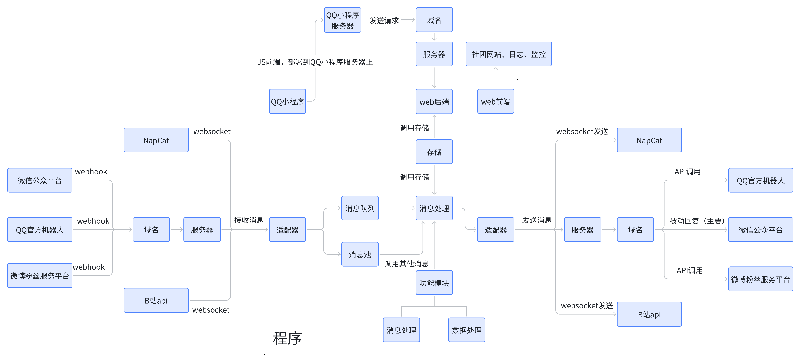

# LRobot


---

## ***LR232*** & ***LR5921***

<div style="display: flex; justify-content: flex-start; align-items: flex-start;">
    
    
    
</div>

[](#)
[](#)
[](#)
[](#)

**鸣谢:**   
> &nbsp;  &nbsp;  &nbsp;  &nbsp;  &nbsp;  &nbsp;

---

**本项目仅作为学习研究使用，切勿用于非法用途**

---

## 项目简介
LRobot 是一款基于 Python 开发的辅助聊天工具，主要服务于社团管理。项目围绕各消息平台构建消息处理和管理系统，旨在为武汉大学逻辑推理协会社员及内阁人员提供信息管理与活动统计、游戏支持与交互等功能

#### 目录
- [相关项目](#相关项目)
- [快速开始](#快速开始)  &nbsp;&nbsp;*部署项目请跳转*
- [项目结构](#项目结构)
- [功能介绍](#功能介绍)  &nbsp;&nbsp;*不写代码看这个*
- [相关技术](#相关技术)  &nbsp;&nbsp;*了解细节看这个*
- [更新日志](#更新日志)
- [常见问题](#常见问题)
- [许可证](#许可证)
- [……]()

---

## 相关项目
1. **[QQ 开放平台](https://q.qq.com/#/)** : 为 QQ 合作伙伴提供多维业务服务与用户管理能力的全新开放平台
2. **[NapCat](https://napneko.github.io/guide/start-install)** : 基于 TypeScript 构建的 Bot 框架,通过相应的启动器或者框架,主动调用 QQ Node 模块提供给客户端的接口,实现 Bot 的功能
3. **[微信公众号平台](https://mp.weixin.qq.com/)** : 微信公众平台是一个为个人、企业和组织提供业务服务与用户管理能力的全新服务平台
4. **[哔哩哔哩-API收集整理](https://socialsisteryi.github.io/bilibili-API-collect/#%F0%9F%8D%B4%E7%9B%AE%E5%BD%95)** : 本项目旨在对 B站 WEB、APP、TV 等客户端中，散落在世界各地的野生 API 进行收集整理，研究使用方法并对其进行说明，运用了黑箱法、控制变量法、代码逆向分析、拆包及反编译法、网络抓包法等研究办法

#### 参考文档
- **[OneBot](https://github.com/botuniverse/onebot-11)** : OneBot11 标准是从原 CKYU 平台的 CQHTTP 插件接口修改而来的通用聊天机器人应用接口标准，适用于不同 bot 平台 api 之间的无缝迁移
- **[QQ 机器人文档](https://bot.q.qq.com/wiki/develop/api-v2/)** : QQ 机器人通过开放的平台承载机器人的定制化功能，让开发者获得更畅快的开发体验
- **[Napcat API 文档](https://napcat.apifox.cn/)** : NapCat 接口文档
- **[微信公众号官方文档](https://developers.weixin.qq.com/doc/offiaccount/Getting_Started/Overview.html)** : 微信公众平台是运营者通过公众号为微信用户提供资讯和服务的平台，而公众平台开放接口则是提供服务的基础，开发者在公众平台网站中创建公众号、获取接口权限后，可以通过阅读本接口文档来帮助开发
- **[QQ 小程序文档](https://q.qq.com/wiki/develop/miniprogram/frame/)** : 小程序开发框架的目标是通过尽可能简单、高效的方式让开发者可以在 QQ 中开发具有原生 APP 体验的服务。[开发工具](https://q.qq.com/wiki/tools/devtool/stable.html)
- **[spacy中基于规则的实体识别](https://blog.xiawei.tech/2021/11/entity-ruler-of-spacy/)** : EntityRuler（实体规则）组件，让你可以基于模式字典添加命名实体，从而可以轻松地将基于规则的命名实体识别和统计命名实体识别结合起来，以使管道更加强大
- **[基于spaCy的命名实体识别](https://zhuanlan.zhihu.com/p/352121461)** : 基于spaCy的命名实体识别 －－－－以“大屠杀”领域命名实体识别研究为例
- **[spaCy V3.0 基于规则匹配(3)----基于规则的命名实体识别NER](https://blog.csdn.net/u014607067/article/details/114391484)** : EntityRuler是一个spaCy管道组件，可以通过基于patterns字典添加命名实体，能够方便基于规则和统计方式的命名实体识别方法相结合，从而实现功能更强大的spaCy管道
- **[CloudDNS](https://www.cloudns.net/index/show/login/)** : CloudDNS 提供免费 DNS、云 DNS、托管 DNS、GeoDNS 和受 DDoS 保护的 DNS 托管，包括网页重定向、邮件转发和循环负载平衡

#### 待参考文档
- **[WeWe Rss](https://github.com/cooderl/wewe-rss)** : 更优雅的微信公众号订阅方式，支持私有化部署、微信公众号RSS生成（基于微信读书）
- **[Rasa](https://zhuanlan.zhihu.com/p/88625091)** : Rasa是一套开源机器学习框架，用于构建基于上下文的AI小助手和聊天机器人
- **[状态机](https://blog.csdn.net/JENREY/article/details/128607990)** : python 实现的有限状态机
- **[魔曰](https://github.com/SheepChef/Abracadabra)** : 文言文加密法（https://abra.halu.ca/）
- **[MediaCrawler](https://github.com/NanmiCoder/MediaCrawler)** : 多社交平台爬虫
- **[微信开放平台](https://chatbot.weixin.qq.com/)** : 微信对话开放平台
- **[公众号爬取](https://blog.csdn.net/kuailebuzhidao/article/details/136490529)** : 公众号爬取
- **[NewsNow](https://github.com/ourongxing/newsnow/blob/main/README.zh-CN.md)** : 实时热门新闻

---

## 快速开始
#### 基础知识
1. 项目采用 docker 运行，即项目可以屏蔽环境差异，在任何环境下快速部署
2. 本项目目的为集成各平台消息服务,实现自定义功能。目前搭载 QQ、Napcat、微信公众平台、B 站、QQ 小程序五个平台的机器人
3. 以下均用 qqbot(LR232),napcat(LR5921),wechat(WECHAT),bilibili(BILI),qqapp(QQAPP) 代替各平台

#### 准备工作
1. 安装好 docker 环境([参考](storage/record/docker.md))
2. 需要将 storage/yml/secret_copy.yaml 重命名为 secret.yaml，根据文件中的配置提示配置各平台参数，并配置服务器和域名  
3. 关于各平台的功能简介、注册方法跳转[平台配置教程](storage/record/platform.md)
4. 在服务器上配置 nginx，将 [nginx.conf](storage/nginx.conf)(参考[服务器配置教程](storage/record/server.md)) 推送到服务器上
#### 项目运行
1. 下载项目 `git clone https://github.com/wwweibu/lrobot.git`
2. 建议浏览一遍平台配置教程和服务器配置教程来了解本项目，项目架构可以参考下方的架构图
3. 为了省钱，本项目采用本地运行+服务器+域名的模式，使用最低配置的服务器，其他模式也可以通过调整配置来实现
4. 在 secret.yaml 中填写 SERVER_IP、SERVER_USERNAME，并放置服务器密钥于 storage/lrobot.pem 处。如果项目本身在服务器上运行则不用填写后者。如果是正向代理+反向代理的配置请自行参考上方的服务器配置教程
5. 填写平台相关信息（ID、SECRET）即代表启用该平台服务，留空（注意不是注释掉）则不启用
6. 编写路径替换函数 secret 替换掉 secret.py 里面的 secret，用于保护你的平台路径
7. 进入项目目录 `cd lrobot`
8. `docker compose up --build -d napcat` 启动 napcat 服务，扫码登录（linux 需要加 sudo，下同）(如果 docker 里的二维码扫描不了打开 storage/napcat/cache)
9. `docker compose up --build -d command` 启动服务器连接与转发，`docker exec -it command sh` 进入容器，`chmod 600 /app/storage/lrobot.pem` `ssh -i /app/storage/lrobot.pem username@ip` 连接服务器，输入 yes，随后重启容器
10. `docker compose up --build -d mysql` `docker compose up --build -d mongodb` 启动数据库服务
11. `docker compose up --build lrobot` 启动 lrobot 主服务，由于安装了 libreoffice，需要 5 分钟左右
12. 可选择在 pycharm 中连接与查看数据源: 数据库-数据源-mysql，端口选择 5925，用户名选择 root，架构选择 lrobot_data;数据库-数据源-MongoDB，端口选择 5924，架构选择 lrobot_log
13. 可以使用 `docker logs xx` 或者 Docker Desktop 查看容器内部日志
14. 若在 pycharm 中开发遇到路径标红的问题，右键 lrobot 子文件夹，将目录标记为-源代码目录

#### 项目开发
进入项目，使用 `git pull origin master`更新
###### 功能开发
1. 在 logic/event 中开发功能
2. 访问 域名/command（需要在/cmd下登录），在页面中添加功能，设置平台及条件等
3. 引入新包时，将包名加入到 lrobot/requirements.in 中，进入 lrobot 文件夹，输入 `docker run -it --rm -v %cd%:/app -w /app python:3.11 bash -c "python -m pip install --upgrade pip && pip install -r requirements.in && pip freeze > requirements.txt"` 生成新的环境依赖
4. 使用 docker compose up --build lrobot 中心构建镜像
###### 前端开发
1. 使用 vscode 打开 vue 文件夹
2. 在 views 里添加页面，在 router/index.js 中添加路径
3. 使用 `npm run dev` 进行测试，打开 http://localhost:5173/
4. 调试完成后，使用 `npm run build` 打包项目到 lrobot 中
###### 数据库更新
1. init.sql 文件需要在 mysql 为空时才能生效
2. 当使用新表时，直接新建，或者删除整个 mysql 文件夹（记得保存数据）后重新启动容器
###### 小程序开发
- 待定

---

## 项目结构
 
- 部署完成后，项目结构应该类似于：
- **command/**                     : 命令行服务(连接服务器)
- **lrobot/**                      : 主服务
- **qqapp/**                       : QQ 小程序存放位置，使用[ QQ 小程序开发者工具](https://q.qq.com/wiki/tools/devtool/stable.html)打开
- **storage/**                     : 数据存储(napcat 数据、mysql 和 mongodb 数据库、系统文件)
- **vue/**                         : vue 开发文件夹，使用 vscode 打开
- **.gitignore**                   : git 忽略文件
- **config.py**                    : 配置脚本
- **docker-compose.yml**           : docker 配置信息
- **LICENSE**                      : 项目许可证 
- **README.md**                    : 项目说明文档
- **requirements.in**              : config.py 依赖包

---

#### **command 服务的结构:**
- **command.py**                   : 命令行脚本
- **Dockerfile**                   : command 服务的创建指令
- **key.sh**                       : 更改 lrobot.pem 权限脚本
- **requirements.txt**             : command 服务依赖包

#### **lrobot 服务的结构：**
- **logic/**                       : 相关功能逻辑
  - **chat/**                      : AI 对话逻辑
  - **command/**                   : 指令逻辑
  - **infra/**                     : 基础功能
  - **game/**                      : 小游戏逻辑
- **message/**                     : 消息相关处理
  - **adapter/**                   : 消息适配器
    - **access_token.py**          : 平台 token 获取
    - **xxx_dispatch.py**          : 各平台消息分发
    - **xxx_receive.py**           : 各平台消息接收
  - **handler/**                   : 消息处理器
    - **msg.py**                   : 消息定义
    - **msg_pool.py**              : 消息池及消息队列
    - **msg_process.py**           : 消息处理流程
    - **msg_send.py**              : 消息发送流程
- **web/**                         : 项目网页前后端
  - **backend/**                   : 项目后端
    - **cab/**                     : 后端服务相关路径
    - **app.py**                   : 后端启动入口
  - **frontend/**                  : 项目前端
    - **dist/**                    : vue 的打包文件
- **Dockerfile**                   : lrobot 服务的创建指令
- **main.py**                      : 程序的主入口
- **requirements.in**              : lrobot 服务依赖包
- **requirements.txt**             : lrobot 服务依赖包

#### storage 的结构
- **data/**                        : 数据存储
  - **mongodb**                    : MongoDB 数据
  - **mysql**                      : Mysql 数据
- **file/**                        : 文件存储
  - **firefly/**                   : logo，测试文件
  - **resource/**                  : 社团资源文件
  - **users/**                     : 用户文件
- **napcat/**                      : napcat 配置信息
- **record/**                      : 参考记录、代码
  - **abandoned/**                 : 暂停使用的代码
  - **img/**                       : markdown 使用的图片(测试记录)
  - **xx.md**                      : 配置说明
- **yml/**                         : yml 配置信息
- **lrobot.pem**                   : 服务器密钥
- **nginx.conf**                   : nginx 配置文件

---

## 功能介绍（待整理）
#### 社团网站
- 项目用
#### 平台功能
###### qqbot
- 主动消息：主动给用户发消息；被动消息：收到消息后给用户回复消息，有效期为私聊60分钟，群聊5分钟，均可回复5次
- 私聊消息：用户与机器人发送的消息（高阶能力-在消息列表添加机器人自动开启）；群聊消息：在群聊中@机器人，机器人收到消息（一条消息存在@机器人即可收到，但无法收到回复消息的回复内容如（回复a消息）@机器人b消息@xxx只能收到“b消息@xxx”）
- 指令面板：可为机器人配置指令面板，将在私聊输入/、群聊@机器人后出现，可配置指令及跳转小程序。同时可配置快捷菜单，在私聊点击 + 的时候出现
- 高阶能力（需刷 dau）：使用自定义 markdown 消息（即像 markdown 一样发送消息）、发送带按键的固定 markdown 消息模板
###### napcat
- 接收各类型消息（具体可在功能-[消息](#消息)
- 实现各类型功能（同上）
#### 消息

###### 消息格式
- ~~字符测试：手机中文25，英文35，窄屏手机24，英文33；电脑中文50英文八十；等号一行24~~
###### 表情识别逻辑
- 存在于表情商城里的表情会被 qqbot 识别成faceType=4，即使添加在收藏里；不存在于表情商城理的表情即使添加在收藏里也会被识别成图片
###### 消息种类及处理逻辑
- **回复消息：1.存在回复以及@机器人即被视作回复消息:因为回复时可以在@前面加入文字并且也可以@其他人；2.@LR5921视为回复，@LR232不做处理：LR232无法
识别回复消息（可以做但无法获取消息id且消息id不统一）；3.回复消息优先级比文件消息、图文消息、文字消息均要高，*回复时无法执行这几种消息的逻辑***
- 消息形式: 序号，平台名（LR232，Weibo，WeChart），内容，触发事件（配对，处理，发送），种类（群聊/私聊/资讯），文件名,下载链接,来源（群）,来源（QQ，公众号名，发送者）,消息 ID,匹配的消息序号
- 多图文消息创建多个消息进行处理
- LR232收到同一图片不同消息时，url不一样

---

## 相关技术（待整理）
### 整体架构
#### 开发流程
- 可参考流程图调试出错位置

###### 系统开发流程
- 项目由三部分构成，以调试机（本机）、运行机（长时间运行机）、服务器代指（运行机=调试机也可行，为方便本人开发设计了三个机器）
- 开发系统时需停止运行机服务，在调试机上进行开发，测试完成后同步至 git 仓库
- 运行机拉取 git 仓库内容，若 storage 内容产生变化，由 u 盘拷贝至运行机，重新运行项目
###### 功能开发与测试流程
- 系统已实现动态更新功能，所以除了基础架构的修改，新功能的添加都可以用动态更新来完成
- 添加新功能时，先在调试机上完成对应函数，提交项目至 git 仓库
- 访问对应 api 使运行机更新仓库
- 配置或修改功能条件(/cab/commands)，新功能添加完成
###### vue 开发流程
- 使用 vscode 打开 vue 文件夹
- 在 views 里配置新页面并加入 index.js 中，在 admin 中配置后端 api
- 使用 npm run dev 运行，运行 lrobot 项目进行测试，前端访问 http://0.0.0.0:5173 ，直到调试成功
- 使用 npm run build，复制 dist 文件夹覆盖掉 web/frontend 下的 dist 文件夹
###### 环境依赖
- 使用 `pip-compile requirements.in` 会依赖当前 windows 环境生成包，可能不符合 linux 上的要求
- 使用 pipreqs 会生成重复包、或者生成遗漏包
- 如果要在不配置好环境的情况下生成包，只有不断运行并往 requirements.in 添加需要的包，并使用命令 `docker run -it --rm -v %cd%:/app -w /app python:3.11 bash -c "python -m pip install --upgrade pip && pip install -r requirements.in && pip freeze > requirements.txt"` 生成对应的 requirements.txt
#### 服务器配置
###### nginx
- nginx 配置在请求头处携带 ip，后端可解析为 `127.0.0.1 - - [06/Feb/2025 17:16:56] "GET /test/ok HTTP/1.1" 200 12345`，分别是 ip，时间，请求方式和路径，返回码，响应体大小，其中响应体大小一般不显示

### 消息(message)
#### 消息处理器(handler)
- 消息的处理过程如下

###### 消息队列(msg_pool)
- 虽然 DS 极力推荐我使用 RabbitMQ、Redis Streams、Kafka，但可以自行实现崩溃优化
- 消息队列主要起到使逻辑清晰的作用
###### 消息处理(msg_process)
- 在 msg_process 中，消息通过判断各属性是否匹配来调用功能

- 动态更新最初采用 update 函数来更新模块，即修改 yaml 文件后修改判断条件和引入函数，但函数模块在导入后就不可修改了，是伪动态更新
- 之后动态更新每次引用函数前手动卸载模块然后重载，实现修改文件的动态更新效果
- 然后修改 yaml 文件的部分移动到了 config 里
#### 消息适配器(adapter)
###### QQAPP
###### WECHAT
- 微信文章字符乱码:在使用json时没有自动转换为中文


### 逻辑功能(logic)
#### ai 对话(chat)
###### 知识库提取(kb)
*安装 Tesseract OCR*
- Windows 安装步骤：
- 下载 Tesseract 安装包（推荐官方发布）：
- 地址：https://github.com/tesseract-ocr/tesseract/releases
- 下载文件如：tesseract-ocr-w64-setup-5.3.1.20230401.exe
- 安装时注意勾选 Add to PATH，或者记住安装目录（比如 C:\Program Files\Tesseract-OCR）。
- 如果你没勾选添加 PATH，需手动添加：
- 打开「系统环境变量」 → 「系统变量」 → 找到 Path → 编辑 → 添加： `C:\Program Files\Tesseract-OCR`
*安装 poppler-utils* 
- pdftotext 是 poppler-utils 包的一部分，因此你需要确保已安装 poppler-utils 或相关工具。
- Windows 用户可以使用以下方式安装：
- 访问 poppler for Windows 下载并解压。
- 将解压后的 bin 目录（包含 pdftotext.exe）添加到系统的 PATH 环境变量中。
- 检查 pdftotext 是否正确安装：
- 打开命令提示符或 PowerShell，输入 pdftotext，看看是否能识别并执行该命令。
###### 知识库查询(kb)
- 不使用 faiss 而使用 sql，每次重复构建 pkl 费时
#### 指令功能(command)
###### 每日发言记录
- 通过get_group_member_info来刷新qq最新发言时间的缓存，之后通过get_group_member_list来获取最近发言时间，使用时间戳进行比较
#### 基础功能(infra)
###### 资讯获取
- 爬虫
- WeWeRss，，用微信读书接口进入，定期更新订阅公众号的文章
- [爬取公众号文章](https://blog.csdn.net/kuailebuzhidao/article/details/136490529)
- 豆瓣apikey
###### 表情包添加文字
- 使用pillow制作
###### 执行命令行代码(command)
*自动重连*
- 使用 `async for line` 代替 `while True:line = await process.stdout.readline()`
- 让重连调用也不会阻塞输出
*关于执行命令行代码(bat/exe/代码)*
- 在推荐的```subprocess.check_output(xxx, stderr=subprocess.STDOUT)```和 ```subprocess.run(xxx,stdout=subprocess.PIPE,stderr=subprocess.PIPE)``` （只能等返回结果，不能实时捕获输出）和 ```subprocess.Popen(xxx,stdout=subprocess.PIPE,stderr=subprocess.PIPE)``` 和 ```subprocess.Popen(xxx,stdout=subprocess.PIPE,stderr=subprocess.STDOUT)```
- 其中只有最后一种将err管道重定向到out管道才有输出，原因可能是loki采用的是go语言，然后里面的输出方式不一样（至今未找到原因）
- 考虑过读取日志文件输出的方式，但可能不及时，且程序退出时需要额外的等待代码来确保日志文件写完读完
- 其中在执行 xiaomiqiu.exe 的时候（当时还在使用小米球），无法捕获到任何命令行输出而只有文件输出，因为要添加-log stdout参数，建议对所有的 exe 文件先 --help 看看说明
- 小米球的日志输出只有一句level info，然后其他的隧道、端口、运行状态都是代码在控制台的输出显示，不是日志
- 加上 ```@echo off```可以在 pycharm 捕获中不显示执行的代码，加上 ```chcp 65001``` 可以防止一些使用 gbk 编码的文件乱码（统一使用 UTF-8)
- 使用 popen 方式可以捕获 Napcat 中的调试代码（不会在正常控制台执行时出现）
- 在主程序退出时，主循环退出，使用 popen 方式执行命令的任务退出，但只有在 try 的 while true 里面能捕获到 popen 的输出，退出后执行 finally 部分的时候，剩余的输出都无法被捕获，无论是使用 signal 模拟 Ctrl+C 信号还是使用 process.wait() 都不行，只有使用 process.communicate() 才能捕获到剩下的输出
###### 服务器扫描(ip)
- 端口有： /，/form.html,/upl.php,/t4,/geoip,/1.php,/password,/TQSd,/nXVA,/aab8, /jquery-3.3.1.slim.min.js,/aab9,/jquery-3.3.2.slim.min.js
- 使用 `ssl_reject_handshake on` 可以避免 Censys 识别服务器 ip ~~（真的吗？）~~
- 使用 Censys 发现服务器 ip 已经泄漏了
###### 时间获取、时间戳转换与时区
- 需要转换为东八区
###### 数据库
- 在 query_database 里加了一条：await conn.commit()
- 在设置泡泡页面多广播的时候，A 页面更新位置后，反复刷新页面，数据库查询的结果会在原位置和新位置反复跳动，但使用 pycharm 连接 mysql 数据库后查询的结果却一直是新位置
- 理由为：
- 在 update_database 中执行了更新并显式提交 conn.commit()，所以更新操作是持久化的。
- 在 query_database 中只是执行了一个查询，但没有提交事务。因此，这个连接上的事务实际上并没有结束（即使查询已经完成）。
- 当这个连接被释放回连接池，然后被另一个请求（可能是 GET 也可能是其他）再次获取时，这个连接上可能还存在一个未提交的事务（实际上是一个空事务，因为没有写操作，但读事务的状态还在）。
- 如果这个连接再次被用于 GET 请求，那么在这个连接上执行新的查询，由于 REPEATABLE READ 隔离级别，它可能会继续使用之前建立的快照（即旧数据），而看不到其他连接提交的更新。
- 所有库都以id为主键，且不许为非空，因为数据库页面的插入行的设定为：给所有的插入空值，mysql允许唯一键为空值
###### 数据库(database)
- 异步队列在调用数据库时会由于读写锁导致延迟
- 在直接读写（靠锁来自行分配）、分五个库（同步多操作）、建立连接池（减少建立连接时间）、使用批量提交（一次性提交）中，批量提交的方法效率最高且接近极限效率
设：建立连接：5ms，提交事务：1ms/10ms(批量)，执行事务：1ms，错误日志：0.1ms

| 方案          | 	连接方式	  | 连接耗时           | 	事务提交耗时          | 	事务执行耗时               | 	错误重试耗时      | 	总时间     |
|-------------|---------|----------------|------------------|-----------------------|--------------|----------|
| 直接读取	       | 每次新建连接  | 	10000 * 5ms   | 	10000 * 1ms	    | 10000 * 1ms           | 	100 * 0.1ms | 	70.01 秒 |
| 拆分 5 个数据库	  | 每库 1 连接 | 	2000 * 5ms	   | 2000 * 1ms	      | 2000 * 1ms            | 	100 * 0.1ms | 	14.01 秒 |
| 连接池（5 连接）	  | 复用连接    | 	5 * 5ms	      | 2000 * 1ms       | 	2000 * 1ms	          | 100 * 0.1ms  | 	4.035 秒 |
| 批量提交（100/批） | 	每次新建连接 | 	2 * 100 * 5ms | 	2 * 100 * 10 ms | 	100 * (100+99) * 1ms | 	100 * 0.1ms | 	22.91 秒 |

- 可以发现，批量提交并没有达到极致效率。拆分和连接池主要是提高并行效率（5倍），同时增加cpu使用率（5倍），拆分相比连接池差在增加了连接耗时。
- 同时可以比较批量提交+单连接复用与连接池，可以发现，在忽略连接时间时，由于错误处理，前者事务提交耗时翻倍，即使事务执行耗时变成了0.1，也是原来的1.05倍时间，后者则只是原来的0.2倍时间。
- 使用 condition 会出现同时唤醒所有正在等待的协程的情况
- 测试用例在[db.py](refer/abandoned/db.py)

### 界面(web)
#### 后端(backend)
###### 后端对比
- Uvicorn:采用 uvloop（一个高效的事件循环库）和 httptools（一个高性能的 HTTP 解析库），因此在 IO 密集型 的应用中性能非常出色。
更专注于 高性能异步，尤其是 单节点应用。
- Hypercorn:可以使用 asyncio、trio 或 curio 作为其事件循环库，允许开发者根据需要选择不同的异步实现。
相对来说更加灵活，适合需要 支持不同异步模式 的场景，如 trio 用户。
多协议支持（包括 HTTP/2、HTTP/3 和 WebSocket）使其适合需要多协议支持的应用。 
- 性能 
- Uvicorn:基于 uvloop 和 httptools，优化了网络 I/O 操作，通常在 性能和响应速度 上稍占优势，尤其是在低延迟和高并发的场景下。
是目前 最快 的异步 Web 服务器之一，特别适用于需要大量并发连接的应用。 
- Hypercorn:虽然性能不错，但由于支持更多协议（如 HTTP/2、HTTP/3 等），它的性能通常略低于 uvicorn，尤其是在非常高并发的负载下。
适合需要灵活性和多协议支持的应用，但如果对性能要求极高，uvicorn 会更具优势
- **flask配置静态资源一定要使用绝对路径**
- flask的调试模式会跟asyncio冲突
#### 前端
###### 文件预览
- 安装 [LibreOffice](https://www.libreoffice.org/donate/dl/win-x86_64/25.2.3/zh-CN/LibreOffice_25.2.3_Win_x86-64.msi)
- 添加`C:\Program Files\LibreOffice\program`进环境变量 path

### 配置（config）
#### 动态更新
- 动态更新时由于保存机制（待研究），按 ctrls 后会触发 watchdog 两次，采用哈希比对来减少更新次数
#### config
- **当多个yaml存在相同属性值时，后面的会覆盖前面的**
#### 路径
- 相对路径和绝对路径，绝对路径就是本机上的绝对路径，受到不同电脑环境因素影响大；但相对路径也不好用，在 python 里面主路径为执行的文件的路径，如果要测试某模块，使用相对路径可能会造成路径错误；在某些包里面，相对路径可能也不是执行文件的路径，而是调用包的文件的路径
- 所以采用一个绝对的相对路径来解决以上所有问题，定义 path.py，项目里的所有路径都引用这个路径，就一定不会出现问题
- ***路径均用相对main的路径，防止单模块测试时出错***
#### future的全局管理与阻塞机制
- 关于future无法刷新的问题，由于flask中自带的werkzurg在独立线程中运行，无法通知其他异步线程中的future更新（可以参考[future.py](script/abandoned/future.py)里面的例子，如果注释掉定期刷新的c函数，则a函数不会通知b函数里的future刷新）,下面注释掉的则是另一种写法
- 代替观察者模式，在A-（等待ws连接发送B）-C用asyncio.future进行等待
- 使用方法:
```    
    try:
        _future = future.get(seq)
        response = await asyncio.wait_for(_future, timeout=20)
    except asyncio.TimeoutError:
        raise Exception(f"消息超时 | 消息: {xml_data}")
        
    future.set(seq, response)
```


### 小程序开发(qqapp)
- 小程序用户验证[参考文档](https://q.qq.com/wiki/develop/miniprogram/API/open_port/port_userinfo.html)
- 小程序管理员认证在 connect.qq.com 申请获取用户 unionid ，使得管理员认证唯一，取代了之前使用用户昵称的方式
- 小程序页面跳转使用 navigateBack 代替 To 来避免10个页面的上限，并且修改/删除后还能回到原光标处,现在程序运行非常快
#### 小程序图片压缩
- 参考代码：
- 压缩到50kb不影响缩略图观看
- 参考chatgpt的两个对话

### 日志
- python 的日志分为
- 如果在 yml 中定义了文件处理器，则不管被不被引用，都会创建一个 .log 文件
- 解决了莫名其妙创建app.log的问题，log.yaml中存在filehandle没有被引用，但还是会自动创建
- 日志的record包含levelname，name，msg，args，pathname，lineno，funcName，created，exc_info
- propagate: no阻止日志向上传播，防止重复记录
- 在每次刷新config后重新替换日志记录器防止被覆盖
- 机器人日志 robot_log 定义: event事件名（四字）,command指令名, robot机器名,target群名及用户名,message信息,time时间
- ***event信息用四个字，调试用六个字***
- ***log形式：{time} | {level} | {source} | {event} | {message}，source为7位英文，event在info为四位中文，debug为六位中文***
- source记录：后端backend，后端服务： 适配器adapter；server远程连接；system系统；
- server 记录格式:
- website记录格式:  [ip]method path -> HTTP/http_version
- adapter记录器格式： ⌈platform⌋ 平台名不存在/消息处理错误 -> e  | 数据:                       令牌刷新、消息接收
- message记录格式： 查询语句异常 -> e | 查询: | 参数:           文件上传失败 -> [404]xxx
- system记录格式:  xx异常 -> e，    运行日志/配置更新/定期检查
- log和config：顺便解决了互相引用的问题以及 config没有加载log无法记录日志、log加载config时需要替换掉str的东西改成自己的类的问题
- ⌈⌋两个括号自取⌊⌉

### 相关知识
###### 接收ws信息的冲突
- 如果在发送消息后自动接收信息，在整个 ws 连接中即 napcat 连接函数下面：A 接收{B 发送，等待 C，接收 C},D 接收，则 B 发送的消息会被 C 接收到；而在其他地方使用 msg_send：1.A 接收，D 接收；2.B 发送，等待 C，接收 C，C 本来要接收的消息会被 D 捕获
###### 快速开始脚本
- 使用 pytest 在开启 flask 或者其他长时间运行程序时，会出现 test 完成但主程序没有停止的情况，直接关闭命令行不会释放资源导致程序卡死
- pytest 的自带日志太多了，所以不采用 test
###### 后端启动相关
- flask 的 app.run(debug=True)会启动 werkzeug 的重载模式，设置信号量 signal.signal，而 python 无法在主线程之外使用信号量，故不能用 debug
###### 任务退出逻辑
- 任务退出时，main 里面 gather 的各子任务收到退出信号取消，不触发 except 模块，直接执行 finally 逻辑；同时，各子任务创建的 n 级子任务会先于一级子任务取消
- 每个任务取消前都会执行其 finally 逻辑
###### 异常捕获机制（退出时）
- main 里面会 print 之前捕获的异常
- main 里面创建的所有 task 的异常都会被捕获
- 但 task 自己使用 create_task 创建的子任务不受 main 管理
- 故取消时可能产生错误
- 如 init_app 里 create_task(server_serve())开启了 uvicorn 服务器，但这个任务的异常没有被处理，需要在创建的新任务上覆盖一个异常捕获器来处理 KeyboardInterrupt 异常
```
async def init_serve():
    try:
        await server.serve()
    except KeyboardInterrupt:
        backend_logger.debug(f"后台服务停止", extra={"event": "运行日志"})
serve_task = asyncio.create_task(init_serve())
```
###### yaml和数据库加解密操作
- 项目中途考虑过 yaml 的加解密操作，即：项目启动时需要添加一行 ```secret=xxx```，否则在运行时，yaml 和数据库中的所有数据都会进行加密，但在读取时会自动解密，其他用户可以在不影响正常使用的情况下无法看到我的 yaml 文件中的密码。
- 但后面考虑到实用性不足，别人需要配置自己的密码，且数据库信息在网站页面也可以浏览到，放弃了这一想法
- 相关实现可以看 [secret.py](refer/abandoned/secret.py)
- A为所有者，B为使用者
- A调用decrypt_files(密码)，无论是否加密，成功解密，yaml和数据库复原，可直接查看；
- B调用decrypt_files()，无论是否加密，成功加密，yaml和数据库上锁，不可直接查看，但不影响使用
- 采用 AESGCM 加密 yaml 文件，采用 sqlite 自带的加密数据库
###### 内部函数、内部导入
- 内部导入主要是为了防止循环引用
- 内部函数主要是为了好看，当逻辑可能多次被调用时，内部函数会被编译多次，效率低
###### 命名规则
- ~~本人有强迫症~~
- 文件名小写及下划线
- 变量和函数小写及下划线
- 类使用驼峰
- 文件夹统一不带s
- **函数名将统一的名字放前面（activities，events等），使用下划线连接，便于识别**
- import将非项目放前面，项目放后面，按照长短排序
- **数据库查询语句统一用query，更新语句统一用update**
- 后端路径使用 robot 名+ _ +接口
- 后端函数名尽量与路径一致
- 函数定义不写返回值，注释用#在代码上方，函数中用 """"""
- 函数、类变量添加类型注解
- ***后续需要修改的代码用 #TODO 来表示***
- **msg=config<log<logic<adapter<app=msg_send<msg_process<msg_pool<main**
- ***所有yaml文件用str不用int（带引号）***
- **常量在引用下面，变量在常量下面；初始化执行代码在最下面**
###### 导入与相对导入
- - ”软件包外部的相对导入“在没有 __init__.py 的文件夹（非包文件夹）中不能用"."来使用相对路径
###### 日志调试（已废弃）
- 可通过 yaml 中的一个字典来快速控制要输出哪些过程日志，现已被网页上日志筛选和过滤代替
###### 敏感数据清理（已废弃）
- 不需要数据库和xml加密，在重构项目时把所有的敏感信息（账号、密码、数据库、网站内容）放在一起，并设计清空函数便于代码分享
- 在 qq 小程序中需要删掉网址路径
- 在 vue 中需删除后端路径
###### anaconda 环境和pycharm环境
- 在 pycharm 中，未命名的环境名为路径名
- 在 anaconda 中，未命名的环境会以路径显示且无名字，只能以路径调用，conda env list
###### 字典相关
- data = data.get("d", {}) plain_token = data.get("plain_token")不返回空字典的情况下，none执行第二句会报错
###### 异步性能提升
- asyncio
- 所有（包括flask，一些常规的函数）都使用异步，防止多个调用同一函数互相阻塞
- ws连接的on_message，多条之间会互相阻塞
- 调用异步计时器防止阻塞
- time.sleep(n)改成asyncio.sleep(n)
- requests.get()
- 进程、线程和协程：进程绕过全局解释器锁（GIL）实现真正的并行，线程通过通过操作系统调度实现并发，协程需要通过await来进行调度。如协程里写while true pass会卡死整个程序，而线程和进程不会
- 对于高并发类型的io处理使用协程（数据库读取，future变量等待，request请求），对于cpu密集型使用线程（ai处理运算）
- 协程在await执行结束后，会到协程队列末尾重新执行
- asyncio.gather当某个任务抛出异常后，如果没有try模块，则会终止一个任务，其他任务继续执行；若有，则会终止所有任务；当某个任务阻塞后，会阻塞所有任务的执行
- while True :await asyncio.sleep(1)这个是为了维持任务存在，但存在更好的方式来代替，如condition；像看门狗使用Event参数一直挂起，则在协程中不占用时间，而在observer线程中进行管理
###### grafana监控(已废弃)
- grafana 系列的配置[教程](script/record/service.md)
###### 事件驱动架构
- EDA
###### 异常
- 每一个异常会被上一级处理
- ***在ws连接中，由ws连接类捕获异常，在消息队列中，由消息队列捕获异常，在消息处理中，由处理的二级函数捕获异常，底层如消息发送、数据库操作只负责抛出异常***

###### 容器
- 由于 QQNT 和 NapCat 等很多都使用了 windows 系统，所以未进行容器化~~绝对不是懒得用linux~~
- 然后 linux 上面不能直接运行 windows 容器
###### 性能极致优化（待实现）
- 使用 Redis存热数据
- 内存管理优化
- 内存映射加速
- python 分配多核
- AtlasOS
###### 装饰器
- 用装饰器来代替重复的if和日志输出
###### 异步连接与连接池
- 在http/2中，同一域名多个路径会复用同一连接
- 但在同一服务下建立连接池/单个连接复用的代价太大，需要考虑到某一连接超时影响所有连接的情况
- 几乎不会出现连接占用所有端口的情况，除了本地的napcat连接外，其他所有的连接都使用1080端口占用的是服务器的端口数

---

## 更新日志
<details>
  <summary>展开查看日志</summary>

#### [1.0.0]
- *项目初始版本*
- 新增消息类型统一定义
- 新增消息队列逻辑
- 新增活动处理逻辑
- 新增 README
#### [1.1.0] 
- *将 HTQQ 框架完全更换为 LLOneBot 框架，杜绝盗号风险*
- 从易语言更换为 python
#### [1.1.1]
- 新增小程序后端 Flask 服务
- 修改消息类型统一定义
#### [1.2.0]
- *物资租借小程序正式上线*
- 修改管理员[认证方式](#小程序管理员认证)
#### [1.3.0]
- *将 LLOneBot 更换成 NapCat 框架，因为 NapCat 在获取最后发言时间的更新上优于 LLOneBot（~~之后发现是本人问题~~）*
- 新增 echo 字段来区分各种消息，统一 ws 收发内容
#### [1.3.1]
- 新增[每日发言记录](#每日发言记录)
#### [1.4.0]
- *换回 LLOneBot 因为能发送 json 格式消息，用于发送小程序*
- 新增 /帮助 指令说明文档
- 新增 /物资借用 功能，返回小程序
- 修改消息格式中的 content，不限制为 str，用于发送**消息数组**
#### [1.5.0]
- *使用JioNLP来处理时间和时间段*
- 修改活动数据库 tasks,可以记录未审核活动便于管理员同时审核多个活动，同时给活动添加了时间段属性
#### [1.6.0]
- *官方机器人指令过审*
- 新增社员信息更新的大部分操作
- 新增社团管家功能
- 修改 botpy 中 post_c2c_file 和 post_group_file 函数使其能上传本地文件
#### [1.7.0]
- *重构项目，增加了消息处理过程中的**异常捕获**而不阻塞，重构了 msg,time,robot 的文件路径，log 和 yaml 的路径,增加了部分注释*
#### [1.8.0]
- *LR5921支持识别不同消息格式，包括戳一戳和回应*
- 修改 log_event 中消息必须是 str 的限制
#### [1.9.0]
- *实现了**热更新**功能，通过update.yaml进行不停服更新*
- 修改 events 文件夹下面的函数排布
- 修改 events 之后的函数处理格式，只传入 msg 一个参数，不传入状态等
- 修改 msg_process 的引用，由于 eval 动态添加的特性所以需要导入一些看上去用不上的模块
#### [2.0.0]
- *小程序与后端服务器并发运行*
- 修改数据库更新方式为 database 中的相关方式
- 新增下载 flask[async] 包来使用异步数据库更新方法
- **新增 delay 异步延时方法，创建新线程池进行计时，使得同步/异步多次调用同一函数也不会互相阻塞**
#### [2.1.0]
- *日志统一，删除并重写了 qqbot 里面所有的日志，只剩下 app 日志和 robot 日志*
- 新增日志调试功能，在 config.yaml 调试列表中新赠值，注释掉对应值即可输出
- 新增 qqbot 连接、LLOneBot 连接、消息队列处理、flask 连接处理中的异常捕获，使得报错不影响运行。
#### [2.2.0]
- *新增**图文消息**格式*
- 修改所有跟数据库相关的操作，将其整合进 database
- 修改指令格式，统一成 **"/+xxx"**
#### [2.3.0]
- *定义文件及文件夹**[命名规则](#命名规则)***
#### [2.3.1]
- 修改数据库获取最大 id(text) 导致添加物资编号只能是最大编号的问题
- 修改小程序打开页面上限过多的问题，更改[小程序页面跳转](#小程序页面跳转)逻辑
#### [2.3.2]
- 新增了 msg 的属性 info 来取代文件名、回复消息、点赞消息等
- 新增图文消息的判断与处理
- 新增不同表情的识别([表情识别逻辑](#表情识别逻辑))
- 修改 LR5921 不启动就无法加载 config 的问题（*离谱*）
- 修改了图片消息的下载方式，LLOneBot 近期更新，消息类型是 image 时直接提供下载链接而不提供 file_id 进行下载
- 修改文件发送方式，qqbot 严格遵守以图片发送和以文件发送两种格式，可以以这两种方式发送图片
#### [2.4.0]
- *更新消息种类与处理方式*
- 新增官方消息中的替换逻辑，使用[]来包裹表情和表情包，与 LR5921 统一
- 新增了 LR5921 中对于**消息段和消息数组的处理函数**
- 删除了纯空格消息的处理
#### [2.5.0]
- ***更新消息发送逻辑，目前可以发送图文消息（默认图文），其中所有文件路径都需要绝对路径***
- 删除了所有消息格式，因为存在老年大字号模式
#### [2.6.0]
- *使用black规范重构代码*
#### [2.7.0]
- ***使用 NapCat 无头启动器启动 qq ，再也不用打开 qq 了***
- napcat.bat 需要加入参数 -q xxxxxx
#### [2.8.0]
- ***使用一体化启动，同时启动service里面的所有异步任务（ws连接和flask连接）和程序（exe和bat）***
#### [2.9.0] - 2024-11-27
- *重构项目结构，把主要功能代码移至 lrobot 中。~~水了一堆日志~~*
- 修改 grafana 的 defaults.ini 的 disable_sanitize_html ，改成 true，用于在 grafana 的 text 组件中识别 html
#### [3.0.0] - 2024-11-29
- *更新了 napcat*
- 修改了 napcat 的端口配置
#### [3.1.0] -2024-12-9
- ***完成了日志记录，重写了log，详见 service.md***
- 修改了 botpy 导入方式，保留自带的 log
- 新增在 config.yml中定义事件和日志级别
#### [3.1.1] -2024-12-9
- ***修改 config，可以加载所有yml文件，然后使用单例模式进行动态更新***
- ***新增 main.py 的绝对路径，来让项目代码更健壮,全部使用pathlib而不使用os***
#### [3.1.2] -2024-12-9
- 新增了日志格式定义
#### [3.2.0] -2024-12-10
- *完成了加密解密流程，二级密钥储存在 .key 里，保证可以正常读取文件，当不存在一级密钥时，secret 里面的文件会被加密*
#### [3.2.1] -2024-12-12
- 修改了异常引用与抛出的机制
#### [3.2.2] -2025-1-8
- **删除 botpy 文件夹，用包模块替代**
#### [3.3.0] -2025-1-10
- *复习软构和软工*
- 新增和删除了一些加密、消息队列、容器、观察者、装饰器相关的处理逻辑
#### [3.4.0]
- ***微信公众号认证失败***
- 删除了微信开放平台的逻辑，因为无法接入非认证账号
#### [3.5.0]
- *豆瓣 apikey 禁止申请，测试几个公开的豆瓣 apikey 后发现无法绑定账号，只能获取少量资讯*
#### [3.6.0] -2025-1-17
- ***使用微信 RSS 订阅公众号***
#### [3.7.0] -2025-1-21
- ***在cloudDNS上申请了域名***
#### [3.7.1] -2025-1-22
- 尝试数个策略后，**最终的方案是国外的免费服务器+国外的域名**
#### [3.8.0] -2025-1-23
- ***规范服务器[配置流程](script/record/host.md)***
#### [3.9.0] -2025-1-25
- ***微信服务器配置完成***
- 新增 curl 模拟微信公众号消息的方法
- 修改微信公众号自定义菜单的配置方式
#### [4.0.0] -2025-1-26
- ***服务器开启后存在网上扫描，需要配置处理方式***
#### [4.1.0] -2025-1-28
- ***微博添加成功***
#### [4.2.0] -2025-2-3
- ***配置好了 gitee，直接在 pycharm 里推送***
#### [4.3.0] -2025-2-5
- ***log 设置完成，自定义 handle 和 filter 实现各种效果***
- 新增关于 to do 代码的规范
#### [4.3.1] -2025-2-5
- 修改路径相关规范
- 新增日志字数定义
#### [4.4.0] -2025-2-7
- 修改服务器配置标准流程
#### [4.5.0] -2025-2-11
- *由于跟主线程 asyncio 冲突，关闭了 flask 的调试模式*
#### [4.6.0] -2025-2-11
- ***动态更新配置完成***
#### [4.7.0] -2025-2-12
- ***botpy 日志更改完成***
#### [4.8.0] -2025-2-13
- ***完全抛弃了botpy，采用webhook的方式进行连接（与微博和微信一样）***
#### [4.8.1] -2025-2-14
- 修改了日志格式
#### [4.9.0] -2025-2-15
- ***多图文消息创建多个消息进行处理***
- **修改了消息格式规范**
#### [4.9.1] -2025-2-17
- 修改 config 和 log 之间的引用逻辑
- 删除了 filehandle，解决了莫名其妙创建app.log的问题
- 修改了异步同步处理规范
#### [5.0.0] -2025-2-17
- ***重新配置了日志的控制台输出格式***
#### [5.1.0] -2025-2-22
- ***重新排版了readme***
- **新增许可证**
- **新增相关技术，整理了所有的AI对话知识点**
- **删除隐私信息，将日志中所有的技术点迁移到相关技术部分**
#### [5.2.0] -2025-3-1
- ***放弃使用pytest转向普通的测试模块来编写快速开始脚本***
#### [5.3.1] -2025-*3-4
- **新增各平台对比表格，允许只配置服务器、只使用部分平台**
#### [5.4.0] -2025-3-5
- ***使用 fastapi 代替 flask，重新配置相关 logger***
- 修改小程序信息处理方式，加入消息队列
#### [5.4.0] -2025-3-6
- ***新增 future 变量管理，修改同步日志线程中更新 future 无法通知等待协程的问题***
- 新增在日志输出判断、后端运行停止方面的 future 用法
#### [5.5.0] -2025-3-8
- ***新增部分测试用例***
#### [5.5.1] -2025-3-9
- 修改 napcat 使用方法与相关许可证，移入原先的日志逻辑
#### [5.6.0] -2025-3-10
- 新增 web 错误捕获函数、异常访问机制、超频访问封禁功能
#### [5.7.0] -2025-3-11
- 完善数据库分池逻辑
- 修改异常捕获机制（见飞书）
#### [5.8.0] -2025-3-12
- 加了一点笑话
- 新增 ssh 测试用例
#### [5.9.0] -2025-3-13
- 所有未完成部分添加 # TODO
- 新增 ssh 自动重连机制
- 新增消息去重机制，防止 qqbot 一条消息推送两次
#### [6.0.0] - 2025-3-14
- 完成了 vue 部分开发
#### [6.1.0] - 2025-3-15
- 完成动态模块导入
- 新增 ssh 自动重连上限
#### [6.2.0] - 2025-3-16
- 消息去重机制验证完成
- 修改消息去重机制，移动到 LR232 接收器内部，将 num 作为唯一键
- 修改了消息初始化机制，避免 content 为空时生成 'None' 字符串
- 修改了动态更新机制，之前为伪动态更新
#### [6.3.0] -2025-3-17
- 再次接入 napcat，修改方式为 http
- 修改本地 1080 的 socks5 端口为 5923
- 修改消息接收时分类机制，可识别空格消息、纯文件消息
#### [6.3.1] -2025-3-19
- 修改消息生成方式，一条消息不生成多消息；
- 删除消息引用，改为完全通过 future 引用，消息池每天清理
- 修改消息文件，储存为列表
- 新增 msg 规范：空值尽量储存为 None
#### [6.4.0] -2025-3-20
- 项目移植：使用 git pull，用 U 盘拷贝 storage 文件夹
- 修改项目的本地 git 记录，使用 storage_tem 来将三个版本合成一个版本
- 删除项目包并重新安装
- 修改小程序和 napcat 的路径至项目外
#### [6.4.1] -2025-3-22
- 修改并简化了 vue 开发流程
- 修改了 readme 的结构
- 新增本地更新模块
#### [6.4.1] -2025-3-31
- 测试完大模型函数调用，部署 ollama 的 qwen2.5:14b 模型以及 glm-4-flash 的 api 调用。
- 新增ai对话、天气查询功能
- 修改了 vue 的功能界面
- 修改 command 属性，重新改为 yaml 数据
#### [6.4.2] -2025-4-1
- 新增愚人节活动
#### [6.4.3] -2025-4-2
- 新增 clean_ssh 方法防止端口占用
#### [6.5.0] -2025-4-2
- 服务无法映射到 0.0.0.0 的问题始终没有解决，直接重装
- 新增计时器，没有采用 [APScheduler](https://blog.csdn.net/qq_43030934/article/details/131421631) 因为和主任务不太兼容（存在问题无法解决）
#### [6.6.0] -2025-4-3
- 服务器配置了 Atlas os 系统，运行明显变快；APScheduler 没有问题，主要是 ssh 连接在长时间没有消息的情况下会挂起导致任务阻塞，需要循环一个 5 分钟的请求
- 修改服务器转发命令，使用本地内网 ip 代替 localhost 来保证转发不出现问题
#### [6.6.1] -2025-4-4
- 修改了服务器转发命令，使用 127.0.0.1 代替 ip 同样可以
#### [6.6.2] -2025-4-6
- 新增 LR232 发送文件时的超时时间，可能是官方修改短了请求时间（？）
#### [6.7.0] -2025-4-7
- 统一了基础消息类型及格式
- 新增 B 站和微信的消息处理
#### [6.7.1] -2025-4-15
- 新增了登录页面，为管理员页面设置cookie
#### [6.7.2] -2025-4-18
- 新增了数据库管理页面
- 修改了 execute_query 方法，返回字典
- 修改了 execute_update 方法，返回行id
#### [6.8.0] -2025-4-18
- 新增了用户组管理页面
- 修改了 config，反向更新 yaml，解决了了config修改与监听器竞争问题
- 修改数据库表头
#### [6.9.0] -2025-4-20
- 完成了多格式文件知识库的生成
- 删除了 Fastapi 的 /docs 等路径（**太危险了**）
#### [6.9.1] -2025-4-23
- 新增清空代理的装饰器
#### [6.9.2] -2025-4-30
- 新增 config 多层嵌套访问不报错
#### [7.0.0] -2025-6-6
- 迁移项目至 docker
- 新增 mysql 和 mongodb 数据库
- 新增 connect 连接方法
- 修改 config 路径使不同容器共享日志和配置
#### [7.0.1] -2025-6-12
- 尝试合并不同平台消息接收、发送逻辑，失败
#### [7.0.2] -2025-6-17
- 新增定时任务传入参数
#### [7.0.3] -2025-6-18
- 新增 b 站消息处理
- 修改消息格式与日志格式至统一
#### [7.1.0] -2025-6-19
- 修改动态模块导入逻辑
- 修改身份逻辑，将身份作为状态的一种，不强制绑定 LR5921 为主平台
#### [7.1.1] -2025-6-24
- 修改 config,增加 _copy.yaml模板
- 新增时间轴和泡泡页面
- 修改 napcat 网络方式
- 删除 config 的初始赋值方式并把 set_log 变成类方法以实现 config 的静态引用及写回
- 修改 Observer 为 PollingObserver，因为容器中无法检测文件变更
- 修改消息内容，图片在消息内容里显示为"[文件]"以支持部分消息处理
#### [7.1.2] -2025-6-28
- 修改 Mysql 的读写方式，保证读不出错
- 修改泡泡页面支持两端操作
- 修改泡泡页面支持同步
#### [7.1.3] -2025-6-29
- 新增平台绑定功能
- 修改模块热重载，支持错误处理
- 新增 data 部分的动态更新
- 新增入会功能
- 新增 cookie 与管理员操作记录
- 新增网页登录 qq 验证
#### [7.1.4] -2025-6-30
- 修改 dockerfile 安装 libreoffice
#### [7.1.5] -2025-7-2
- 新增测试身份与密码设置逻辑
- 新增功能展示面板
- 新增测试员登录逻辑
- 新增测试员与管理员路由逻辑
#### [7.1.6] -2025-7-3
- 新增数据库备份
- 修改日志数据库格式
- 修改 wiki 页面
</details>

***

## 常见问题
#### Q:如何联系上开发者？
#### A:建议直接添加QQ:3502644244，发消息或者邮箱都行。配置环境时的相关问题都会整理到这里。
#### Q:可以参与开发吗？
#### A:由于是个人项目，有什么其他功能想法或者优雅的代码书写方式都建议直接教我。当然，欢迎 PR
#### Q:为什么要开发这个项目？
#### A:由于协会传统萌发了开发机器人的想法，之后先后找到了 MYQQ、qqbot 和 LLOnebot、Napcat。官方 QQ 机器人框架限制过多，审核过程繁琐且一个月只能发四条主动消息，消息回复只能有五条，无法获取到消息发送者的 QQ （*就离谱*），获取群成员等群聊相关 API 还在等开发；个人 Napcat 启动器的缺点是发送消息太多可能被屏蔽，且不能输入''/''快速调出指令并 @ 机器人，每次查询指令比较繁琐。然后没有官方机器人 dau 达到500后的被动 markdown 功能，所以可以各取所长，以官方 QQ 机器人为主， NapCat 为辅搭建一个LRobot系统。首先是统一二者API，使用自定义的消息类以及自定义的消息发送逻辑实现。接着是逻辑处理，官方 QQ 机器人负责主要指令调用与回复，NapCat 负责信息查询（成员发言时间获取），群聊转私聊，发送额外消息。两个机器人通过群消息二合一来“激活”用户，同时通过数据库记录“状态”实现单用户多消息、多用户多消息的互通。之后又有了开发更多平台的机器人的想法，于是就有了目前的项目。
***

## 许可证

本项目采用混合许可证，包含：

- 自定义有限使用许可，仅限非商业及内部学习使用；
- 部分代码采用 MIT 许可证；
- 部分内容遵循 Creative Commons Attribution-NonCommercial 4.0 国际许可协议（禁止商业用途）；
- 项目依赖的 NapCat 服务采用其自定义有限再发布许可。

详细许可证请参见项目根目录 LICENSE 文件。

***

## ……
- [x] **QQ机器人审核通过**
- [x] **信管局审核网址通过**
- [x] **小程序快点审核过**
- [x] **QQ机器人指令审核快一点**
- [x] **设计两个谁都解不出来的头像**
- [x] **~~申请特例开启被动markdown消息失败~~**
- [x] **~~微信公众号申请个人认证失败~~**
- [x] **删除 msg_xxx 中的敏感信息**
- [x] **考虑给消息加一个结果id，或者加在消息池里面，便于 future 获取结果**
- [x] **数据库分多个库，新增数据库连接池，添加失败回滚机制**
- [x] **增加审核模式应对 qq 平台审核，在功能判断时增加身份组**
- [x] **动态更新用单例类懒加载+watchdog监听文件变更**
- [x] **审核和运行模式在config里配置**
- [x] **防止常见的ddos攻击**
- [x] **~~流量通过cloudflare代理并且将静态资源托管？~~**
- [x] **项目正常运行后，删除环境并重新配置**
- [x] **把小米球的命令也做成函数，写明白配置方法**
- [x] **napcat检测输入状态**
- [x] **采用一种方法能在主机上测试新功能（测试接口√）**
- [x] **项目许可证**
- [x] **~~每个适配器创建连接池~~**
- [x] **在发送消息的获取、每日打卡统计等地方引入 future 模式，用一个函数完成解析 ws 接收的 echo 的功能**
- [x] **~~使用 Prometheus 和 Grafana 和 windows_exporter 和 loki 和 sql 监测性能、输出日志~~**
- [x] **~~服务器用于验证二级服务，域名用于搭建监控以及社团网站~~**
- [x] **~~向微信小程序迁移，调用蓝牙、NFC等接口。失败，无法使用QQ账号实现~~**
- [ ] **数据库快照/天**
- [ ] **LR232不能直接上传文件了，只能文件分享**
- [ ] **统一的消息适配器，自动解析 json 格式**
- [ ] **功能函数加载使用字典映射，在配置消息后自动重载字典，不用每次消息处理时加载模块**
- [ ] **使用LR232_receive_module.LR232_receive()来重载各平台消息接收**
- [ ] **concurrent.futures.ProcessPoolExecutor能突破GIL限制**
- [ ] **p = psutil.Process(os.getpid()) p.cpu_affinity([0, 1]) p.nice(psutil.HIGH_PRIORITY_CLASS)**
- [ ] **数据库**
- [ ] **Flask 查询时图片读取的优化（集体读取？）**
- [ ] **蓝绿部署？**
- [ ] **数据库读写和分库比较，future和队列比较，日志存储与备份容灾**
- [ ] **微信消息处理在下一个请求到来前可以成功回复消息（<5s)，然后一般会发送两个请求（有时三个），可以实现14s内的无延迟通话**
- [ ] **第一次内测顺利**
- [ ] **刷DAU拿到被动markdown消息**
- [ ] **网络异常处理：一个平台异常调用其他可用平台发送消息**
- [ ] **重建gitee仓库**
- [ ] **用路径来配置运行机的git动态更新**
- [ ] **测试删除storage后的执行效果**
- [ ] **在@5921后面直接跟上表情包会被识别成text但处理后跟mface类型相同**
- [ ] **接收消息使用的是消息段格式而get_msg是消息数组格式，所以无法具体解析点赞和撤回消息**
- [ ] **msg_get 返回消息段数组，需要更改函数**
- [ ] **日志使用装饰器，消息使用工厂模式（？）**
- [ ] **测试LR5921在消息发送失败后的日志**
- [ ] **不用的变量用__**
- [ ] **看看 Dify**
- [ ] **小程序发送消息数组，但消息内容必须是str**
- [ ] **指令统一:"/+xxx"**
- [ ] **突破GIL锁和单线程限制，配置更高级的python运行环境**
- [ ] **详细解析系统各任务的处理方式与消息的处理顺序**
- [ ] **公有平台的聚合；消息模块同异步的关系，消息方式；；域名转发逻辑**、
- [ ] **考虑表情放在内容中统一处理**


