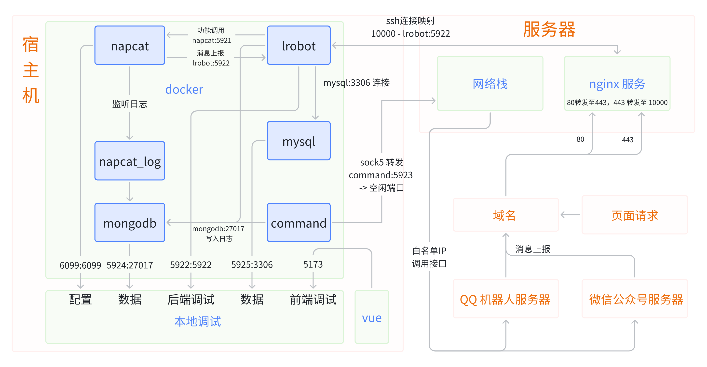
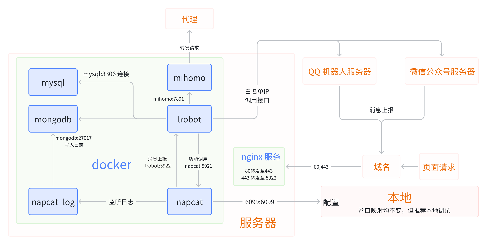

# LRobot

---

## ***LR232*** & ***LR5921***

    
    
    

**鸣谢:**   
> &nbsp;  &nbsp;  &nbsp;  &nbsp;  &nbsp;  &nbsp;

---

**本项目仅作为学习研究使用，切勿用于非法用途**

---

[项目文档](https://wwweibu.github.io/Lrobot/)

## 项目优点
- 多平台接入: 一套代码同时支持 QQ 机器人、Napcat、微信、B 站、网页
- 统一消息标准: 自动封装并转换不同平台消息格式，简化多端开发难度
- 模块化架构: 功能按需加载，支持动态热更新与快速扩展
- 开箱即用的教程: 从零到部署，初学者也能跟着完成
- 开放接口: 便于二次开发与功能自定义

---

## 写在前面
- 本项目其实就是一个消息处理器，将各平台的各种标准统一处理，整体没有什么复杂度
- 但看各类文档比较费时，所以把文档中的信息整理一下，写了一些平台的配置教程，装作自己干了很多事
- 所谓的多平台，就是把每种不同的标准包起来，丢掉不需要的，如果包一层不行，就再包一层
- 以及，由于本人没有 AI 厉害，所以**本项目中所有的前端代码均由 AI 生成，内容仅供参考，请仔细甄别**
- 主要想为大家省去读文档、调接口的时间，希望能一起进步 ~另外，腾讯回复真的很慢；逆向的大佬们真的很强~
- 刚接触代码的人可以从*快速开始*开始，在部署中逐渐了解相关知识
- 代码大佬也可以根据此教程以及代码中的注释，从详细的架构说明、功能描述、页面前后端中选择自己需要的部分引用

## 项目简介
- **LRobot 是一款基于 Python 开发的辅助聊天工具，主要服务于社团管理**
- 项目围绕各消息平台构建消息处理和管理系统，涵盖 QQ、微信、B 站、网页四个平台的界面和指令功能
- 以下均用 **LR232(qqbot)**,**LR5921(Napcat)**,**WECHAT(wechat)**,**BILI(bilibili)** 代替各平台
- 项目有各步骤详细的说明及教学，虽然涉及到账号申请、部署、准备数据等内容比较**麻烦**，但完成后可以发挥想象，设计更多更有趣的功能；同时给有一定经验的开发者做一个参考
- 项目将持续更新……
- ~*可以猜猜为什么叫这个名*~
- 项目文档地址 https://wwweibu.github.io/Lrobot
- 项目架构
  - 方案 B
  
  - 方案 A
  

---

## 快速开始
> 方案 A，[教程](https://wwweibu.github.io/Lrobot/docs/1项目总览/1快速开始)里有更详细的步骤说明及方案 B
1. 服务器上配置 nginx,将 storage/nginx.conf 作为 nginx 配置文件
2. 服务器安装好 docker 环境
3. 注册并配置各平台信息
4. 下载并进入项目 `git clone https://github.com/wwweibu/Lrobot.git` `cd Lrobot`
5. 将 storage/yml 文件夹中含 copy 后缀的文件重命名去掉 copy(其中 secret.yaml 需要根据文件中的配置提示配置各平台参数)
6. 启动 napcat 服务
    - `docker compose up --build -d napcat`(linux 需要加 sudo，下同)
    - 访问`http://服务器ip:6099/webui`进行登录,napcat 日志中获取密码，扫码登录 qq
    - 配置 HTTP 服务器，`启用-开启Debug-主机:0.0.0.0-port:5921`
    - 配置 HTTP 客户端，`启用-开启 Debug-URL:http://lrobot:5922/LR5921/ (配置了 secret 记得改成加密后的路径)-上报自身消息`
    - `其他配置-登录配置`里填写当前 QQ
7. 启动 mihomo 服务
   - 编辑`storage/yml/agent_copy.yaml`为 agent.yaml，保留前几行，后面使用对应的 mihomo 代理配置
   - `docker compose up --build -d mihomo`启动服务
8. 启动数据库服务
    - `docker compose up --build -d mysql`
    - `docker compose up --build -d mongodb` 
9. 启动 napcat 监听服务
   - `docker compose up --build -d napcat_log`
10. 启动 lrobot 主服务
    - `docker compose up --build -d lrobot`
    - 需安装 libreoffice，预计 10 分钟

---

## 功能展示

[功能](https://wwweibu.github.io/Lrobot/docs/1项目总览/3项目功能)

---

## 许可证

本项目基于 **GNU General Public License v3.0 (GPL-3.0)** 许可证

#### 第三方组件
本项目使用了以下第三方资源：

|                                       组件                                       |     用途     |          原始许可证           |
|:------------------------------------------------------------------------------:|:----------:|:------------------------:|
|                [NapCatQQ](https://github.com/NapNeko/NapCatQQ)                 | 获取Docker镜像 | [自定义非商业协议](#NapCat许可证声明) |
|                 [mihomo](https://github.com/MetaCubeX/mihomo)                  | 获取Docker镜像 |           MIT            |
| [bilibili-API-collect](https://github.com/SocialSisterYi/bilibili-API-collect) |  API调用参数   |       CC BY-NC 4.0       |
|  [bilibili_live_tool](https://github.com/chenxi-Eumenides/bilibili_live_tool)  |   参考加密方式   |         MPL-2.0          |
|              [docusaurus](https://github.com/facebook/docusaurus)              |    文档网站    |      MIT, CC-BY-4.0      |
|           [chinese-xinhua](https://github.com/pwxcoo/chinese-xinhua)           |    成语数据    |           MIT            |

#### NapCat许可证声明
Limited Redistribution License for NapCat

Copyright © 2024 Mlikiowa

1. Usage and Reproduction:
   - Unauthorized use, reproduction, modification, or distribution of this code is prohibited without explicit permission from the main author of the NapCat repository.
   
2. Redistribution:
   - Redistribution of this code is permitted, provided that the full text of this license is included, and the source and copyright information is clearly stated.
   - Minor modifications and extensions are allowed for redistribution purposes, but the modified code must not be publicly released.

3. Non-Commercial Use:
   - This code is not to be used for any commercial purposes.

4. Additional Permissions:
   - Any rights not explicitly addressed in this license must be requested from and granted by the main author of the NapCat repository.

5. Disclaimer:
   - This code is provided "as is," without any express or implied warranties, including but not limited to the implied warranties of merchantability and fitness for a particular purpose. In no event shall the author be liable for any damages or other liability arising from, out of, or in connection with the use or distribution of this code.

#### 说明
**使用者需自行确保遵守所有第三方组件的许可证要求**
 
- 本项目代码以 GNU General Public License v3.0 (GPL-3.0) 授权
- 但本项目中包含的部分第三方组件采用不同的许可证（例如 CC BY-NC 4.0, MPL-2.0, MIT 等）
- 在使用、修改或分发本项目时，您必须同时遵循这些第三方组件的原始许可证条款
- 对于 **bilibili-API-collect**，本项目仅引用了其中公开的接口地址、参数和返回结构等信息，未包含原仓库的文字性文档内容。但因其原始仓库采用 CC BY-NC 4.0 协议，相关信息的使用需遵守该协议的要求

详见 [LICENSE](LICENSE) 文件

