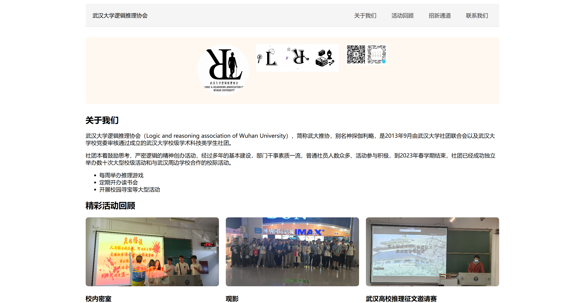
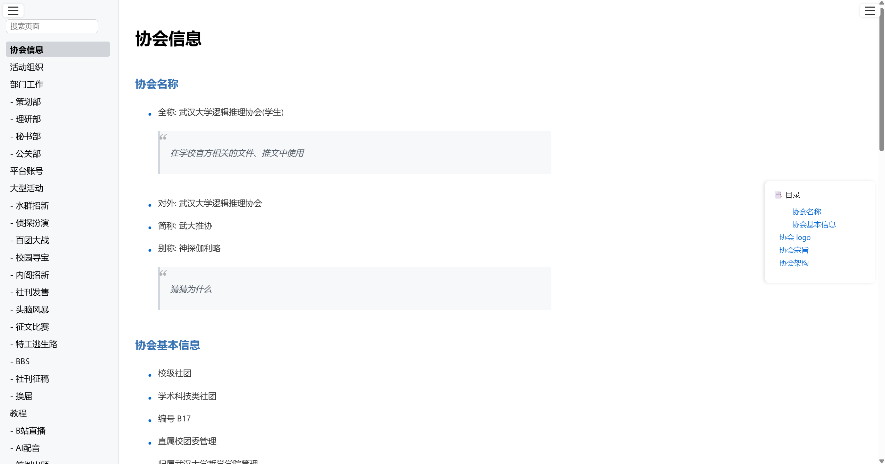
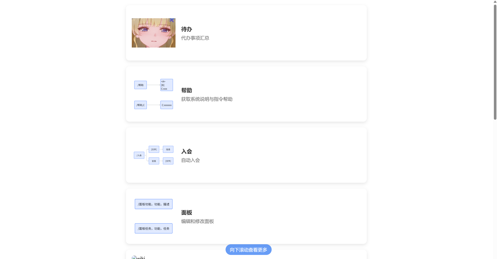

# LRobot

---

## ***LR232*** & ***LR5921***

    
    
    

**鸣谢:**   
> &nbsp;  &nbsp;  &nbsp;  &nbsp;  &nbsp;  &nbsp;

---

**本项目仅作为学习研究使用，切勿用于非法用途**

---

## 项目简介

- LRobot 是一款基于 Python 开发的辅助聊天工具，主要服务于社团管理。项目围绕各消息平台构建消息处理和管理系统，涵盖QQ、微信、B
  站、QQ 小程序、网页五个平台的界面和指令功能
- 依据快速开始中的步骤选择需要的平台部署项目，筛选并修改需要的指令，设计对应的页面，开发新的功能
- 项目有各步骤详细的说明及教学，虽然涉及到账号申请、部署、添加数据等内容比较麻烦，但完成后可以发挥想象，设计更多更有趣的功能；同时给有一定经验的开发者做一个参考
- 项目将持续更新……

#### 目录
- [相关项目](#相关项目)
- [快速开始](#快速开始)  &nbsp;&nbsp;*部署项目请跳转*
- [项目结构](#项目结构)
- [功能介绍](#功能介绍)  &nbsp;&nbsp;*不写代码看这个*
- [相关技术](#相关技术)  &nbsp;&nbsp;*了解细节看这个*
- [更新日志](#更新日志)
- [常见问题](#常见问题)
- [许可证](#许可证)
- [……]()

---

## 相关项目
1. **[QQ 开放平台](https://q.qq.com/#/)** : 为 QQ 合作伙伴提供多维业务服务与用户管理能力的全新开放平台
2. **[NapCat](https://napneko.github.io/guide/start-install)** : 基于 TypeScript 构建的 Bot 框架,通过相应的启动器或者框架,主动调用 QQ Node 模块提供给客户端的接口,实现 Bot 的功能
3. **[微信公众号平台](https://mp.weixin.qq.com/)** : 微信公众平台是一个为个人、企业和组织提供业务服务与用户管理能力的全新服务平台
4. **[哔哩哔哩-API收集整理](https://socialsisteryi.github.io/bilibili-API-collect/#%F0%9F%8D%B4%E7%9B%AE%E5%BD%95)** : 本项目旨在对 B站 WEB、APP、TV 等客户端中，散落在世界各地的野生 API 进行收集整理，研究使用方法并对其进行说明，运用了黑箱法、控制变量法、代码逆向分析、拆包及反编译法、网络抓包法等研究办法
5. **[B站开播、下播、获取推流码工具](https://github.com/chenxi-Eumenides/bilibili_live_tool/tree/master)** : 本程序用于开启直播、结束直播、获取推流码、修改直播标题、修改直播分区

#### 参考文档
- **[OneBot](https://github.com/botuniverse/onebot-11)** : OneBot11 标准是从原 CKYU 平台的 CQHTTP 插件接口修改而来的通用聊天机器人应用接口标准，适用于不同 bot 平台 api 之间的无缝迁移
- **[QQ 机器人文档](https://bot.q.qq.com/wiki/develop/api-v2/)** : QQ 机器人通过开放的平台承载机器人的定制化功能，让开发者获得更畅快的开发体验
- **[Napcat API 文档](https://napcat.apifox.cn/)** : NapCat 接口文档
- **[微信公众号官方文档](https://developers.weixin.qq.com/doc/offiaccount/Getting_Started/Overview.html)** : 微信公众平台是运营者通过公众号为微信用户提供资讯和服务的平台，而公众平台开放接口则是提供服务的基础，开发者在公众平台网站中创建公众号、获取接口权限后，可以通过阅读本接口文档来帮助开发
- **[QQ 小程序文档](https://q.qq.com/wiki/develop/miniprogram/frame/)** : 小程序开发框架的目标是通过尽可能简单、高效的方式让开发者可以在 QQ 中开发具有原生 APP 体验的服务。[开发工具](https://q.qq.com/wiki/tools/devtool/stable.html)
- **[spacy中基于规则的实体识别](https://blog.xiawei.tech/2021/11/entity-ruler-of-spacy/)** : EntityRuler（实体规则）组件，让你可以基于模式字典添加命名实体，从而可以轻松地将基于规则的命名实体识别和统计命名实体识别结合起来，以使管道更加强大
- **[基于spaCy的命名实体识别](https://zhuanlan.zhihu.com/p/352121461)** : 基于spaCy的命名实体识别 －－－－以“大屠杀”领域命名实体识别研究为例
- **[spaCy V3.0 基于规则匹配(3)----基于规则的命名实体识别NER](https://blog.csdn.net/u014607067/article/details/114391484)** : EntityRuler是一个spaCy管道组件，可以通过基于patterns字典添加命名实体，能够方便基于规则和统计方式的命名实体识别方法相结合，从而实现功能更强大的spaCy管道
- **[CloudDNS](https://www.cloudns.net/index/show/login/)** : CloudDNS 提供免费 DNS、云 DNS、托管 DNS、GeoDNS 和受 DDoS 保护的 DNS 托管，包括网页重定向、邮件转发和循环负载平衡
- **[微信开放平台](https://chatbot.weixin.qq.com/)** : 微信对话开放平台

#### 待参考文档
- **[WeWe Rss](https://github.com/cooderl/wewe-rss)** : 更优雅的微信公众号订阅方式，支持私有化部署、微信公众号RSS生成（基于微信读书）
- **[Rasa](https://zhuanlan.zhihu.com/p/88625091)** : Rasa是一套开源机器学习框架，用于构建基于上下文的AI小助手和聊天机器人
- **[状态机](https://blog.csdn.net/JENREY/article/details/128607990)** : python 实现的有限状态机
- **[魔曰](https://github.com/SheepChef/Abracadabra)** : 文言文加密法（https://abra.halu.ca/）
- **[MediaCrawler](https://github.com/NanmiCoder/MediaCrawler)** : 多社交平台爬虫
- **[公众号爬取](https://blog.csdn.net/kuailebuzhidao/article/details/136490529)** : 公众号爬取
- **[NewsNow](https://github.com/ourongxing/newsnow/blob/main/README.zh-CN.md)** : 实时热门新闻

---

## 快速开始
#### 基础知识
1. 项目采用 docker 运行，即项目可以屏蔽环境差异，在任何环境下快速部署
2. 本项目目的为集成各平台消息服务,实现自定义功能。目前搭载 QQ、Napcat、微信公众平台、B 站、QQ 小程序五个平台的机器人
3. 以下均用 qqbot(LR232),napcat(LR5921),wechat(WECHAT),bilibili(BILI),qqapp(QQAPP) 代替各平台

#### 准备工作
1. 安装好 docker 环境，参考[docker 配置教程](storage/record/docker.md)
2. 关于各平台的功能简介、注册方法跳转[平台配置教程](storage/record/platform.md)，其中的回调地址验证可以在配置完服务器后进行
3. 需要将 storage/yml/secret_copy.yaml 重命名为 secret.yaml，根据文件中的配置提示配置各平台参数，并配置服务器和域名
4. 将 storage_copy.yaml 和 user_copy.yaml 去掉 copy
5. 在服务器上配置 nginx，将 [nginx.conf](storage/nginx.conf) 推送到服务器上作为 nginx
   配置文件，参考[服务器配置教程](storage/record/server.md)

#### 项目运行
1. 下载项目 `git clone https://github.com/wwweibu/Lrobot.git`
2. 建议浏览一遍平台配置教程和服务器配置教程来了解本项目，项目架构可以参考下方的架构图
3. 为了省钱，本项目采用本地运行+服务器+域名的模式，使用最低配置的服务器，其他模式也可以通过调整配置来实现
4. 在 secret.yaml 中填写 SERVER_IP、SERVER_USERNAME，并放置服务器密钥于 storage/lrobot.pem 处
5. 填写平台相关信息（ID、SECRET）即代表启用该平台服务，留空（注意不是整条注释掉）则不启用
6. 编写路径替换函数 secret 替换掉 secret.py 里面的 secret，用于保护你的平台路径（防止从域名/LR232路径处直接截取你的流量）
7. 进入项目目录`cd Lrobot`（注意里面还有一个 lrobot 文件夹，进入的是外面的）
8. `docker compose up --build -d napcat` 启动 napcat 服务，扫码登录（linux 需要加 sudo，下同）(如果 docker 里的二维码扫描不了打开
   storage/napcat/cache 或访问网址)，访问 http://127.0.0.1:6099/webui?token=napcat 进行配置，配置 HTTP 服务器，启用-开启
   Debug-port:5921；配置 HTTP 客户端，启用-开启 Debug-URL：http://lrobot:5922/LR5921/ （LR5921 如果配置了 secret
   记得改成自己的）-上报自身消息;并在其他配置-登录配置里填写当前 QQ
9. `docker compose up --build -d command` 启动服务器连接与转发，`docker exec -it command sh`
   进入容器，`chmod 600 /app/storage/lrobot.pem`,`ssh -i /app/storage/lrobot.pem username@ip` 连接服务器，输入 yes，随后重启容器
10. `docker compose up --build -d mysql`,`docker compose up --build -d mongodb` 启动数据库服务(由于电脑不支持 6.0 的
    mongodb 所以换成了 4.4)
11. `docker compose up --build lrobot` 启动 lrobot 主服务，由于安装了 libreoffice，需要 5 分钟左右
12. 可以使用 `docker logs xx` 或者 Docker Desktop 查看容器内部日志

#### 项目开发

- 进入项目，使用 `git pull origin master`更新
- 可使用 pycharm 开发
- 在 pycharm 中连接与查看数据源（需启动数据库容器）: 数据库-数据源-mysql，端口选择 5925，用户名选择 root，架构选择
  lrobot_data;数据库-数据源-MongoDB，端口选择 5924，架构选择 lrobot_log
- 若遇到数据库语句标红，可配置对应的数据库方言并右键选择对应架构
- 若遇到路径标红，右键 lrobot 子文件夹，将目录标记为-源代码目录
- 若遇到项目包标红，设置-python 解释器-docker compose-选择 lrobot-选择 python 解释器
- 引入新包时，将包名加入到 lrobot/requirements.in 中（注意是小写的），进入 lrobot
  文件夹，输入 `docker run -it --rm -v %cd%:/app -w /app python:3.11 bash -c "python -m pip install --upgrade pip && pip install -r requirements.in && pip freeze > requirements.txt"`
  生成新的环境依赖

###### 功能开发

1. 在 logic/command 中开发功能，编辑后可看到`模块加载成功: logic.command.xxx`的日志
2. 访问 域名/cab/command（需要在 域名/cmd 下登录），在页面中添加功能，设置平台及条件等
3. 若项目包变化，参考项目开发中引入新包的办法，并使用 docker compose up --build lrobot 重新构建镜像

###### 前端开发
1. 使用 vscode 打开 vue 文件夹
2. 在 views 里添加页面，在 router/index.js 中添加路径
3. (注意使用`import { http } from '@/api.js';`)，在后端 web/cab 中添加路径，重启 lrobot 容器
4. 使用 `npm run dev` 进行测试，打开 http://localhost:5173/
5. 调试完成后，使用 `npm run build` 自动打包项目到 lrobot 中（已配置好打包路径为 lrobot/web/frontend）

###### 数据库更新

1. init.sql 文件需要在 mysql 为空时才能生效，初始化前需要清空 storage/mysql 文件夹
2. 当创建新表时，直接新建，或者删除整个 mysql 文件夹（记得保存数据）后重新启动容器
3. 数据库备份方法
  - 系统 24 小时自动备份一次
  - 手动备份:`docker exec -it lrobot /bin/bash`,`cd /app/logic/data`,`python backup.py`
  - 备份文件在 storage/backup 处
4. 数据库恢复方法
  - `docker exec -it mysql bash`,`mysql -u root lrobot_data < /app/backup/mysql_2025-07-03.sql`
  - `docker exec -it mongodb bash`,`mongorestore --drop --uri="mongodb://localhost:27017" /app/backup/mongo_2025-07-03`

---

## 项目结构

- 部署完成后，Lrobot 文件夹下目录应该类似于：
- **command/**                     : 命令行服务(连接服务器)
- **lrobot/**                      : 主服务
- **qqapp/**(*未上传*)              : QQ
  小程序存放位置，使用 [QQ 小程序开发者工具](https://q.qq.com/wiki/tools/devtool/stable.html)打开
- **storage/**                     : 数据存储(napcat 数据、mysql 和 mongodb 数据库、系统文件)
- **vue/**                         : vue 开发文件夹，使用 vscode 打开
- **.gitignore**                   : git 忽略文件
- **config.py**                    : 配置脚本
- **docker-compose.yml**           : docker 配置信息
- **LICENSE**                      : 项目许可证 
- **README.md**                    : 项目说明文档
- **requirements.in**              : config.py 依赖包
- **secret.py**                    : 路径加密函数

---

#### **command 服务的结构:**
- **command.py**                   : 命令行脚本
- **Dockerfile**                   : command 服务的创建指令
- **requirements.txt**             : command 服务依赖包

#### **lrobot 服务的结构：**
- **logic/**                       : 相关功能逻辑
  - **command/**                   : 指令逻辑
  - **data/**                      : 数据处理
- **message/**                     : 消息相关处理
  - **adapter/**                   : 消息适配器
    - **access_token.py**          : 平台 token 获取
    - **xxx_dispatch.py**          : 各平台消息分发
    - **xxx_receive.py**           : 各平台消息接收
  - **handler/**                   : 消息处理器
    - **msg.py**                   : 消息定义
    - **msg_pool.py**              : 消息池及消息队列
    - **msg_process.py**           : 消息处理流程
    - **msg_send.py**              : 消息发送流程
- **web/**                         : 项目网页前后端
  - **backend/**                   : 项目后端
    - **cab/**                     : 后端服务相关路径
    - **app.py**                   : 后端启动入口
  - **frontend/**                  : 项目前端
    - **dist/**                    : vue 的打包文件
- **Dockerfile**                   : lrobot 服务的创建指令
- **main.py**                      : 程序的主入口
- **requirements.in**              : lrobot 服务依赖包
- **requirements.txt**             : lrobot 服务依赖包

#### storage 的结构

- **backup/**(*未上传，自动生成*)     : 数据库备份文件
- **data/**                        : 数据存储
  - **initdb**                     : Mysql 初始化文件
  - **mongodb**(*未上传，自动生成*)   : MongoDB 数据
  - **mysql**(*未上传，自动生成*)     : Mysql 数据
- **file/**                        : 文件存储
  - **command/**(*未上传*)          : 指令中使用的图片
  - **firefly/**                   : logo，测试文件
  - **resource/**(*未上传*)         : 社团资源文件
    - **clouddrive/**              : 网盘文件
    - **panel/**                   : 展板照片文件
    - **recycle/**                 : 网盘回收站
    - **wiki/**                    : wiki 照片文件
  - **user/**(*未上传*)            : 用户文件
  - **wiki/**(*未上传*)             : wiki 内容文件
- **napcat/**(*未上传，自动生成*)     : napcat 配置信息
- **record/**                      : 参考记录、代码
  - **abandoned/**                 : 暂停使用的代码
  - **img/**                       : markdown 使用的图片(测试记录)
  - **xx.md**                      : 配置教程
- **yml/**                         : yml 配置信息
  - **secret.yaml**(*未上传，复制*)  : 系统配置
  - **user.yaml**(*未上传，复制*)    : 用户配置
- **lrobot.pem**(*未上传*)          : 服务器密钥
- **nginx.conf**                   : nginx 配置文件

---

## 功能介绍
#### 社团网站

- 社团主页，展示联系方式与活动信息
  
- 登录页，管理员与测试员的登录处，管理员使用限时验证码，测试员使用账号密码
  
- 管理页，管理员登录后可访问，包含协会的wiki，左侧导航栏，右侧目录，导航栏下方是其他管理功能
  
- 测试页，管理员和测试员可访问，包含当前已有功能、界面介绍，以及待办
  
- 泡泡页，展示新的想法，创建、移动、修改泡泡会同步到所有观看该页面的人处
  
- 时间轴，展示协会一年的活动时间轴，可自由添加、修改、移动时间节点，支持多类型事件
  
- 网盘，可自由进行上传文件/文件夹、下载、重命名、移动、创建目录、删除等操作，并可预览图片类、文字类、office 类文件，支持视频文件的流式预览
  
- 数据库，以腾讯文档多人协作的方式编辑后端数据库，可新建/删除行、修改数据
  
- 日志，支持时间、来源、级别、事件的筛选以及消息内容的检索与正则检索，自动分页100/页
  
- 指令，配置指令，编辑名称、响应内容、匹配方式、消息类型、适用平台、触发状态、适用用户和群聊、触发函数
  
- 用户组，配置后端管理员和适配群的用户组
  

#### 平台功能

- 帮助，用户获取帮助信息及词条
  
- 面板，添加、修改面板展示页
  

---

## 相关技术

- 文字太多导致 pycharm 卡死，故迁移至 [相关技术](storage/record/technology.md)

#### **record 目录结构**

- **computer.md**                   : Atlas os 系统安装指南
- **docker.md**                     : docker 相关知识
- **model.md**                      : 大模型 API 调用方法
- **msg_xxx.md**                    : 平台消息原数据示例
- **platform.md**                   : 各平台申请认证方法
- **server.md**                     : 服务器配置指南
- **service.md**                    : 额外服务配置与日志格式化
- **technology.md**                 : 项目技术说明
- **abandoned/**                    : 废弃文件夹
  - **ai.py**                       : 模型调用与通信逻辑
  - **aiohttp_test.py**             : 正向代理测试(用于验证 websocket 相关问题)
  - **botpy.py**                    : QQ 机器人 botpy 包的原调用逻辑
  - **db.py**                       : 展示数据库连接池写入的顺序
  - **douban.py**                   : 豆瓣现有 apikey 的调用测试(待整理)
  - **future.py**                   : future 与协程、线程的相关测试(用于解决 future 线程唤醒的问题)
  - **LR5921.py**                   : LLOneBot 调用逻辑，可移植至类似的 ws 连接处
  - **secret.py**                   : 数据库自动加密与解密逻辑
  - **service.py**                  : 多服务(cmd)启动与日志格式化
  - **speaker.py**                  : 获取每日发言人数与龙王的逻辑(待整理)
  - **wechat_open.py**              : 微信开放平台调用逻辑
  - **weibo.py**                    : 微博粉丝服务平台调用逻辑
  - **wewe_rss.py**                 : wewe_rss 项目适配逻辑(待整理)

---

## 更新日志

  
展开查看日志

#### [1.0.0]
- *项目初始版本*
- 新增消息类型统一定义
- 新增消息队列逻辑
- 新增活动处理逻辑
- 新增 README
#### [1.1.0] 
- *将 HTQQ 框架完全更换为 LLOneBot 框架，杜绝盗号风险*
- 从易语言更换为 python
#### [1.1.1]
- 新增小程序后端 Flask 服务
- 修改消息类型统一定义
#### [1.2.0]
- *物资租借小程序正式上线*
- 修改管理员[认证方式](#小程序管理员认证)
#### [1.3.0]
- *将 LLOneBot 更换成 NapCat 框架，因为 NapCat 在获取最后发言时间的更新上优于 LLOneBot（~~之后发现是本人问题~~）*
- 新增 echo 字段来区分各种消息，统一 ws 收发内容
#### [1.3.1]
- 新增[每日发言记录](#每日发言记录)
#### [1.4.0]
- *换回 LLOneBot 因为能发送 json 格式消息，用于发送小程序*
- 新增 /帮助 指令说明文档
- 新增 /物资借用 功能，返回小程序
- 修改消息格式中的 content，不限制为 str，用于发送**消息数组**
#### [1.5.0]
- *使用JioNLP来处理时间和时间段*
- 修改活动数据库 tasks,可以记录未审核活动便于管理员同时审核多个活动，同时给活动添加了时间段属性
#### [1.6.0]
- *官方机器人指令过审*
- 新增社员信息更新的大部分操作
- 新增社团管家功能
- 修改 botpy 中 post_c2c_file 和 post_group_file 函数使其能上传本地文件
#### [1.7.0]
- *重构项目，增加了消息处理过程中的**异常捕获**而不阻塞，重构了 msg,time,robot 的文件路径，log 和 yaml 的路径,增加了部分注释*
#### [1.8.0]
- *LR5921支持识别不同消息格式，包括戳一戳和回应*
- 修改 log_event 中消息必须是 str 的限制
#### [1.9.0]
- *实现了**热更新**功能，通过update.yaml进行不停服更新*
- 修改 events 文件夹下面的函数排布
- 修改 events 之后的函数处理格式，只传入 msg 一个参数，不传入状态等
- 修改 msg_process 的引用，由于 eval 动态添加的特性所以需要导入一些看上去用不上的模块
#### [2.0.0]
- *小程序与后端服务器并发运行*
- 修改数据库更新方式为 database 中的相关方式
- 新增下载 flask[async] 包来使用异步数据库更新方法
- **新增 delay 异步延时方法，创建新线程池进行计时，使得同步/异步多次调用同一函数也不会互相阻塞**
#### [2.1.0]
- *日志统一，删除并重写了 qqbot 里面所有的日志，只剩下 app 日志和 robot 日志*
- 新增日志调试功能，在 config.yaml 调试列表中新赠值，注释掉对应值即可输出
- 新增 qqbot 连接、LLOneBot 连接、消息队列处理、flask 连接处理中的异常捕获，使得报错不影响运行。
#### [2.2.0]
- *新增**图文消息**格式*
- 修改所有跟数据库相关的操作，将其整合进 database
- 修改指令格式，统一成 **"/+xxx"**
#### [2.3.0]
- *定义文件及文件夹**[命名规则](#命名规则)***
#### [2.3.1]
- 修改数据库获取最大 id(text) 导致添加物资编号只能是最大编号的问题
- 修改小程序打开页面上限过多的问题，更改[小程序页面跳转](#小程序页面跳转)逻辑
#### [2.3.2]
- 新增了 msg 的属性 info 来取代文件名、回复消息、点赞消息等
- 新增图文消息的判断与处理
- 新增不同表情的识别([表情识别逻辑](#表情识别逻辑))
- 修改 LR5921 不启动就无法加载 config 的问题（*离谱*）
- 修改了图片消息的下载方式，LLOneBot 近期更新，消息类型是 image 时直接提供下载链接而不提供 file_id 进行下载
- 修改文件发送方式，qqbot 严格遵守以图片发送和以文件发送两种格式，可以以这两种方式发送图片
#### [2.4.0]
- *更新消息种类与处理方式*
- 新增官方消息中的替换逻辑，使用[]来包裹表情和表情包，与 LR5921 统一
- 新增了 LR5921 中对于**消息段和消息数组的处理函数**
- 删除了纯空格消息的处理
#### [2.5.0]
- ***更新消息发送逻辑，目前可以发送图文消息（默认图文），其中所有文件路径都需要绝对路径***
- 删除了所有消息格式，因为存在老年大字号模式
#### [2.6.0]
- *使用black规范重构代码*
#### [2.7.0]
- ***使用 NapCat 无头启动器启动 qq ，再也不用打开 qq 了***
- napcat.bat 需要加入参数 -q xxxxxx
#### [2.8.0]
- ***使用一体化启动，同时启动service里面的所有异步任务（ws连接和flask连接）和程序（exe和bat）***
#### [2.9.0] - 2024-11-27
- *重构项目结构，把主要功能代码移至 lrobot 中。~~水了一堆日志~~*
- 修改 grafana 的 defaults.ini 的 disable_sanitize_html ，改成 true，用于在 grafana 的 text 组件中识别 html
#### [3.0.0] - 2024-11-29
- *更新了 napcat*
- 修改了 napcat 的端口配置
#### [3.1.0] -2024-12-9
- ***完成了日志记录，重写了log，详见 service.md***
- 修改了 botpy 导入方式，保留自带的 log
- 新增在 config.yml中定义事件和日志级别
#### [3.1.1] -2024-12-9
- ***修改 config，可以加载所有yml文件，然后使用单例模式进行动态更新***
- ***新增 main.py 的绝对路径，来让项目代码更健壮,全部使用pathlib而不使用os***
#### [3.1.2] -2024-12-9
- 新增了日志格式定义
#### [3.2.0] -2024-12-10
- *完成了加密解密流程，二级密钥储存在 .key 里，保证可以正常读取文件，当不存在一级密钥时，secret 里面的文件会被加密*
#### [3.2.1] -2024-12-12
- 修改了异常引用与抛出的机制
#### [3.2.2] -2025-1-8
- **删除 botpy 文件夹，用包模块替代**
#### [3.3.0] -2025-1-10
- *复习软构和软工*
- 新增和删除了一些加密、消息队列、容器、观察者、装饰器相关的处理逻辑
#### [3.4.0]
- ***微信公众号认证失败***
- 删除了微信开放平台的逻辑，因为无法接入非认证账号
#### [3.5.0]
- *豆瓣 apikey 禁止申请，测试几个公开的豆瓣 apikey 后发现无法绑定账号，只能获取少量资讯*
#### [3.6.0] -2025-1-17
- ***使用微信 RSS 订阅公众号***
#### [3.7.0] -2025-1-21
- ***在cloudDNS上申请了域名***
#### [3.7.1] -2025-1-22
- 尝试数个策略后，**最终的方案是国外的免费服务器+国外的域名**
#### [3.8.0] -2025-1-23
- ***规范服务器[配置流程](script/record/host.md)***
#### [3.9.0] -2025-1-25
- ***微信服务器配置完成***
- 新增 curl 模拟微信公众号消息的方法
- 修改微信公众号自定义菜单的配置方式
#### [4.0.0] -2025-1-26
- ***服务器开启后存在网上扫描，需要配置处理方式***
#### [4.1.0] -2025-1-28
- ***微博添加成功***
#### [4.2.0] -2025-2-3
- ***配置好了 gitee，直接在 pycharm 里推送***
#### [4.3.0] -2025-2-5
- ***log 设置完成，自定义 handle 和 filter 实现各种效果***
- 新增关于 to do 代码的规范
#### [4.3.1] -2025-2-5
- 修改路径相关规范
- 新增日志字数定义
#### [4.4.0] -2025-2-7
- 修改服务器配置标准流程
#### [4.5.0] -2025-2-11
- *由于跟主线程 asyncio 冲突，关闭了 flask 的调试模式*
#### [4.6.0] -2025-2-11
- ***动态更新配置完成***
#### [4.7.0] -2025-2-12
- ***botpy 日志更改完成***
#### [4.8.0] -2025-2-13
- ***完全抛弃了botpy，采用webhook的方式进行连接（与微博和微信一样）***
#### [4.8.1] -2025-2-14
- 修改了日志格式
#### [4.9.0] -2025-2-15
- ***多图文消息创建多个消息进行处理***
- **修改了消息格式规范**
#### [4.9.1] -2025-2-17
- 修改 config 和 log 之间的引用逻辑
- 删除了 filehandle，解决了莫名其妙创建app.log的问题
- 修改了异步同步处理规范
#### [5.0.0] -2025-2-17
- ***重新配置了日志的控制台输出格式***
#### [5.1.0] -2025-2-22
- ***重新排版了readme***
- **新增许可证**
- **新增相关技术，整理了所有的AI对话知识点**
- **删除隐私信息，将日志中所有的技术点迁移到相关技术部分**
#### [5.2.0] -2025-3-1
- ***放弃使用pytest转向普通的测试模块来编写快速开始脚本***
#### [5.3.1] -2025-*3-4
- **新增各平台对比表格，允许只配置服务器、只使用部分平台**
#### [5.4.0] -2025-3-5
- ***使用 fastapi 代替 flask，重新配置相关 logger***
- 修改小程序信息处理方式，加入消息队列
#### [5.4.0] -2025-3-6
- ***新增 future 变量管理，修改同步日志线程中更新 future 无法通知等待协程的问题***
- 新增在日志输出判断、后端运行停止方面的 future 用法
#### [5.5.0] -2025-3-8
- ***新增部分测试用例***
#### [5.5.1] -2025-3-9
- 修改 napcat 使用方法与相关许可证，移入原先的日志逻辑
#### [5.6.0] -2025-3-10
- 新增 web 错误捕获函数、异常访问机制、超频访问封禁功能
#### [5.7.0] -2025-3-11
- 完善数据库分池逻辑
- 修改异常捕获机制（见飞书）
#### [5.8.0] -2025-3-12
- 加了一点笑话
- 新增 ssh 测试用例
#### [5.9.0] -2025-3-13
- 所有未完成部分添加 # TODO
- 新增 ssh 自动重连机制
- 新增消息去重机制，防止 qqbot 一条消息推送两次
#### [6.0.0] - 2025-3-14
- 完成了 vue 部分开发
#### [6.1.0] - 2025-3-15
- 完成动态模块导入
- 新增 ssh 自动重连上限
#### [6.2.0] - 2025-3-16
- 消息去重机制验证完成
- 修改消息去重机制，移动到 LR232 接收器内部，将 num 作为唯一键
- 修改了消息初始化机制，避免 content 为空时生成 'None' 字符串
- 修改了动态更新机制，之前为伪动态更新
#### [6.3.0] -2025-3-17
- 再次接入 napcat，修改方式为 http
- 修改本地 1080 的 socks5 端口为 5923
- 修改消息接收时分类机制，可识别空格消息、纯文件消息
#### [6.3.1] -2025-3-19
- 修改消息生成方式，一条消息不生成多消息；
- 删除消息引用，改为完全通过 future 引用，消息池每天清理
- 修改消息文件，储存为列表
- 新增 msg 规范：空值尽量储存为 None
#### [6.4.0] -2025-3-20
- 项目移植：使用 git pull，用 U 盘拷贝 storage 文件夹
- 修改项目的本地 git 记录，使用 storage_tem 来将三个版本合成一个版本
- 删除项目包并重新安装
- 修改小程序和 napcat 的路径至项目外
#### [6.4.1] -2025-3-22
- 修改并简化了 vue 开发流程
- 修改了 readme 的结构
- 新增本地更新模块
#### [6.4.1] -2025-3-31
- 测试完大模型函数调用，部署 ollama 的 qwen2.5:14b 模型以及 glm-4-flash 的 api 调用。
- 新增ai对话、天气查询功能
- 修改了 vue 的功能界面
- 修改 command 属性，重新改为 yaml 数据
#### [6.4.2] -2025-4-1
- 新增愚人节活动
#### [6.4.3] -2025-4-2
- 新增 clean_ssh 方法防止端口占用
#### [6.5.0] -2025-4-2
- 服务无法映射到 0.0.0.0 的问题始终没有解决，直接重装
- 新增计时器，没有采用 [APScheduler](https://blog.csdn.net/qq_43030934/article/details/131421631) 因为和主任务不太兼容（存在问题无法解决）
#### [6.6.0] -2025-4-3
- 服务器配置了 Atlas os 系统，运行明显变快；APScheduler 没有问题，主要是 ssh 连接在长时间没有消息的情况下会挂起导致任务阻塞，需要循环一个 5 分钟的请求
- 修改服务器转发命令，使用本地内网 ip 代替 localhost 来保证转发不出现问题
#### [6.6.1] -2025-4-4
- 修改了服务器转发命令，使用 127.0.0.1 代替 ip 同样可以
#### [6.6.2] -2025-4-6
- 新增 LR232 发送文件时的超时时间，可能是官方修改短了请求时间（？）
#### [6.7.0] -2025-4-7
- 统一了基础消息类型及格式
- 新增 B 站和微信的消息处理
#### [6.7.1] -2025-4-15
- 新增了登录页面，为管理员页面设置cookie
#### [6.7.2] -2025-4-18
- 新增了数据库管理页面
- 修改了 execute_query 方法，返回字典
- 修改了 execute_update 方法，返回行id
#### [6.8.0] -2025-4-18
- 新增了用户组管理页面
- 修改了 config，反向更新 yaml，解决了了config修改与监听器竞争问题
- 修改数据库表头
#### [6.9.0] -2025-4-20
- 完成了多格式文件知识库的生成
- 删除了 Fastapi 的 /docs 等路径（**太危险了**）
#### [6.9.1] -2025-4-23
- 新增清空代理的装饰器
#### [6.9.2] -2025-4-30
- 新增 config 多层嵌套访问不报错
#### [7.0.0] -2025-6-6
- 迁移项目至 docker
- 新增 mysql 和 mongodb 数据库
- 新增 connect 连接方法
- 修改 config 路径使不同容器共享日志和配置
#### [7.0.1] -2025-6-12
- 尝试合并不同平台消息接收、发送逻辑，失败
#### [7.0.2] -2025-6-17
- 新增定时任务传入参数
#### [7.0.3] -2025-6-18
- 新增 b 站消息处理
- 修改消息格式与日志格式至统一
#### [7.1.0] -2025-6-19
- 修改动态模块导入逻辑
- 修改身份逻辑，将身份作为状态的一种，不强制绑定 LR5921 为主平台
#### [7.1.1] -2025-6-24
- 修改 config,增加 _copy.yaml模板
- 新增时间轴和泡泡页面
- 修改 napcat 网络方式
- 删除 config 的初始赋值方式并把 set_log 变成类方法以实现 config 的静态引用及写回
- 修改 Observer 为 PollingObserver，因为容器中无法检测文件变更
- 修改消息内容，图片在消息内容里显示为"[文件]"以支持部分消息处理
#### [7.1.2] -2025-6-28
- 修改 Mysql 的读写方式，保证读不出错
- 修改泡泡页面支持两端操作
- 修改泡泡页面支持同步
#### [7.1.3] -2025-6-29
- 新增平台绑定功能
- 修改模块热重载，支持错误处理
- 新增 data 部分的动态更新
- 新增入会功能
- 新增 cookie 与管理员操作记录
- 新增网页登录 qq 验证
#### [7.1.4] -2025-6-30
- 修改 dockerfile 安装 libreoffice
#### [7.1.5] -2025-7-2
- 新增测试身份与密码设置逻辑
- 新增功能展示面板
- 新增测试员登录逻辑
- 新增测试员与管理员路由逻辑
#### [7.1.6] -2025-7-3
- 新增数据库备份
- 修改日志数据库格式
- 修改 wiki 页面
- 新增数据库迁移
#### [7.1.7] -2025-7-5
- 新增面板界面编辑方式
- 删除消息中的空格回车处理
- 新增指令界面滚动条
- 修改面板界面图片和换行格式
#### [7.1.8] -2025-7-6
- 消息池清理测试完成
#### [7.1.9] -2025-7-6
- 网盘挂载并整理完成
#### [7.2.0] -2025-7-6
- 备忘录迁移完成
- 修改网盘视频文件预览方式，支持流式传输

#### [7.2.1] -2025-7-7

- 完成 LR232 收发测试；发送图片日志测试；事件测试
- 修改日志网页查询的正则判断
- 新增 LR232 返回消息 id 使用 future 和发送*0 获取，用于撤回
- 新增 napcat 快速登录配置（再也不用扫码了）

#### [7.3.0] -2025-7-9

- 重构代码，编写技术说明
- 修改 message/adapter 的挂载方式，变成编译(fastapi 无法简单的动态更新)
- 删除 LR232 的私聊/群聊 开启/关闭推送消息

#### [7.3.1] -2025-7-12

- 新增 LR5921 的代码
- 修改消息内容为 Onebot 的消息段格式，防止在内容里发送"\[表情:xx]"类似的内容被错误识别
- 修改指令页消息颜色为动态分配

#### [7.3.2] -2025-7-15

- 修改优化 msg 的种类
- 新增 BILI、WECHAT 的收发形式
- 修改 ssh 重启方式，退出容器 + 自动重启来代替命令
- 新增 B 站直播码获取
- 新增消息、密码验证列表的持久化
- 新增 ctrl+c 信号的处理
- 新增 LR5921 原消息处的字符串转 json 处理
- 修改 LR232 和 WECHAT 的令牌存储方式，不需要每次重启都重新请求令牌

***

## 常见问题
#### Q:如何联系上开发者？
#### A:建议直接添加QQ:3502644244，发消息或者邮箱都行。配置环境时的相关问题都会整理到这里。
#### Q:可以参与开发吗？
#### A:由于是个人项目，有什么其他功能想法或者优雅的代码书写方式都建议直接教我。当然，欢迎 PR
#### Q:为什么要开发这个项目？
#### A:由于协会传统萌发了开发机器人的想法，之后先后找到了 MYQQ、qqbot 和 LLOnebot、Napcat。官方 QQ 机器人框架限制过多，审核过程繁琐且一个月只能发四条主动消息，消息回复只能有五条，无法获取到消息发送者的 QQ （*就离谱*），获取群成员等群聊相关 API 还在等开发；个人 Napcat 启动器的缺点是发送消息太多可能被屏蔽，且不能输入''/''快速调出指令并 @ 机器人，每次查询指令比较繁琐。然后没有官方机器人 dau 达到500后的被动 markdown 功能，所以可以各取所长，以官方 QQ 机器人为主， NapCat 为辅搭建一个LRobot系统。首先是统一二者API，使用自定义的消息类以及自定义的消息发送逻辑实现。接着是逻辑处理，官方 QQ 机器人负责主要指令调用与回复，NapCat 负责信息查询（成员发言时间获取），群聊转私聊，发送额外消息。两个机器人通过群消息二合一来“激活”用户，同时通过数据库记录“状态”实现单用户多消息、多用户多消息的互通。之后又有了开发更多平台的机器人的想法，于是就有了目前的项目。
***

## 许可证

本项目采用混合许可证，包含：

- 自定义有限使用许可，仅限非商业及内部学习使用；
- 部分代码采用 MIT 许可证；
- 部分内容遵循 Creative Commons Attribution-NonCommercial 4.0 国际许可协议（禁止商业用途）；
- 项目依赖的 NapCat 服务采用其自定义有限再发布许可。

详细许可证请参见项目根目录 LICENSE 文件。

***

## ……

- [x] **QQ 机器人审核通过**
- [x] **信管局审核网址通过**
- [x] **小程序快点审核过**
- [x] **QQ 机器人指令审核快一点**
- [x] **设计两个谁都解不出来的头像**
- [x] **~~申请特例开启被动markdown消息失败~~**
- [x] **~~微信公众号申请个人认证失败~~**
- [x] **删除 msg_xxx 中的敏感信息**
- [x] **考虑给消息加一个结果 id，或者加在消息池里面，便于 future 获取结果**
- [x] **数据库分多个库，新增数据库连接池，添加失败回滚机制**
- [x] **增加审核模式应对 qq 平台审核，在功能判断时增加身份组**
- [x] **动态更新用单例类懒加载+watchdog 监听文件变更**
- [x] **审核和运行模式在 config 里配置**
- [x] **防止常见的 ddos 攻击**
- [x] **~~流量通过 cloudflare 代理并且将静态资源托管~~**
- [x] **项目正常运行后，删除环境并重新配置**
- [x] **把小米球的命令也做成函数，写明白配置方法**
- [x] **napcat 检测输入状态**
- [x] **采用一种方法能在主机上测试新功能（测试接口√）**
- [x] **项目许可证**
- [x] **~~每个适配器创建连接池~~**
- [x] **在发送消息的获取、每日打卡统计等地方引入 future 模式，用一个函数完成解析 ws 接收的 echo 的功能**
- [x] **~~使用 Prometheus 和 Grafana 和 windows_exporter 和 loki 和 sql 监测性能、输出日志~~**
- [x] **~~服务器用于验证二级服务，域名用于搭建监控以及社团网站~~**
- [x] **~~向微信小程序迁移，调用蓝牙、NFC等接口。失败，无法使用QQ账号实现~~**
- [x] **数据库快照/天**
- [x] **~~统一的消息适配器，自动解析 json 格式~~**
- [x] **功能函数加载使用字典映射，在配置消息后自动重载字典，不用每次消息处理时加载模块**
- [x] **~~使用LR232_receive_module.LR232_receive()来重载各平台消息接收~~没必要**
- [x] **数据库优化**
- [x] **数据库读写和分库比较（结果：不如mysql），future和队列比较（结果：单文件队列，多文件future），日志存储与备份容灾（√）**
- [x] **~~网络异常处理：一个平台异常调用其他可用平台发送消息~~**
- [x] **重建gitee仓库**
- [x] **~~用路径来配置运行机的git动态更新~~**
- [x] **测试删除 storage 后的执行效果**
- [x] **日志使用装饰器，~~消息使用工厂模式~~**
- [x] **测试 LR5921 在消息发送失败后的日志**
- [x] **指令统一:"/+xxx"**
- [x] **详细解析系统各任务的处理方式与消息的处理顺序**
- [x] **公有平台的聚合；消息模块同异步的关系，消息方式；域名转发逻辑**、
- [x] **考虑表情放在内容中统一处理**
- [x] **测试各平台消息中的回车是否能正确处理**
- [x] **~~使用 Redis 存热数据~~**
- [x] **用装饰器来代替重复的 if 和日志输出**
- [ ] **更新 bili 和 wechat 的多种消息处理**
- [ ] **重新解析lr5921的消息返回值（200不一定成功）**
- [ ] **LR232使用发送1、2、3的机制来回复同一消息**
- [ ] **消息池添加keep字段**
- [ ] **LR232不能直接上传文件了，只能文件分享**
- [ ] **等到 Agent 完成重新编辑 model.md 部分**
- [ ] **检查 B 站 cookie 是否要刷新以及刷新（如果频繁掉线的话）**
- [ ] **concurrent.futures.ProcessPoolExecutor能突破GIL限制，突破GIL锁和单线程限制，配置更高级的python运行环境**
- [ ] **p = psutil.Process(os.getpid()) p.cpu_affinity([0, 1]) p.nice(psutil.HIGH_PRIORITY_CLASS)**
- [ ] **Flask 查询时图片读取的优化（集体读取？）**
- [ ] **蓝绿部署？**
- [ ] **微信消息处理在下一个请求到来前可以成功回复消息（<5s)，然后一般会发送两个请求（有时三个），可以实现14s内的无延迟通话**
- [ ] **第一次内测顺利**
- [ ] **刷DAU拿到被动markdown消息**
- [ ] **在@5921后面直接跟上表情包会被识别成text但处理后跟mface类型相同**
- [ ] **msg_get 返回消息段数组，需要更改函数**
- [ ] **看看 Dify**
- [ ] **小程序发送消息数组，但消息内容必须是str**
- [ ] **内存管理优化**
- [ ] **内存映射加速**
- [ ] **python 分配多核**
