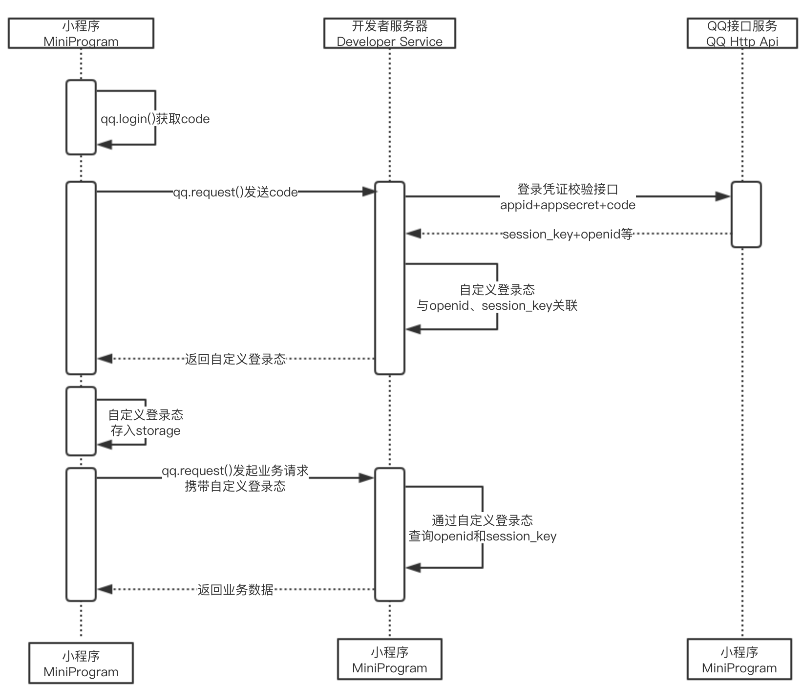

## 平台选择
- 高校社团没有企业执照、企业资质，只能申请个人类型的开放平台账号，并且在认证时由于其团体属性存在认证失败的情况
- 以下是各平台参考

#### 项目使用的平台

|  需求  |                QQ（官方）                 | QQ（napcat）  |       微信公众号        |      微博       |        b站         |    QQ小程序     |
|:----:|:-------------------------------------:|:-----------:|:------------------:|:-------------:|:-----------------:|:------------:|
| 注册方式 |              qq邮箱（1号1个）               |     qq号     |   微信公众号注册（个体工商户）   |     微博账号      |       b站账号        | qq邮箱注册（1号1个） |
| 使用方式 | http(websocket)(botpy)/https(webhook) |   napcat    |   http(webhook)    | http(webhook) |       b站api       |  https(域名)   | 
|  功能  |       被动回复消息（60分钟），功能面板，频道消息管理        | 发送消息、群管理等功能 | 被动回复消息（即时），创建草稿，发表 |    读取评论及私信    | 查询视频、回复私信、直播及发布相关 |    JS小程序     |

- 本项目暂不考虑 qqbot 的频道相关功能
- 使用 webhook 的原因：botpy 的 websocket 方法在文档中标明 24 年底会逐步废弃（好像已废弃了），且 webhook 方法更自由
- qqbot 在日活跃用户 2000 可以解锁被动发送 markdown 消息（特殊消息的一种，语法类似 markdown）
- 微信公众号认证后可以主动向用户发送消息、进行文章推送、配置自定义菜单等
- 微信公众号分为订阅号（面向个人）和服务号（面向企业），认证指的是经过认证后在账号首页展示个人信息，[参考](https://kf.qq.com/faq/1910307JVbAj191030rquYn2.html)，个人账号可以申请个人认证，企业账号可以申请企业认证，但企业属性较强却没有营业执照只能申请订阅号的社团无法申请成功个人认证
- 发表指的是在公众号主页发表文章，推送指的是在公众号主页发表文章并主动推送至用户消息列表，服务号每日拥有4次发表权限，订阅号只有1次
- 微博的申请注册过了一个月仍在审核中，故暂不考虑微博相关功能

#### 其他平台
|  平台   |       微信对话开放平台       | 钉钉  | 飞书  |         豆瓣         |      百度贴吧      |  小红书  |  快手   |   抖音   | 知乎 | 今日头条 | 简书 | 虎扑 | soul |
|:-----:|:--------------------:|:---:|:---:|:------------------:|:--------------:|:-----:|:-----:|:------:|:--:|:----:|:--:|:--:|:----:|
| 不使用原因 | 需要认证，且功能与微信公众号平台基本重合 | 可开发 | 可开发 | api已停止申请，已申请的可继续使用 | api已废弃，申请邮箱已注销 | 需商家认证 | 需企业认证 | 无私信api | 无  |  无   | 无  | 无  |  无   |

- [微信对话开放平台](https://chatbot.weixin.qq.com/login)需要认证过的微信公众号，相比微信公众号平台在文章编辑、推送方面的功能缺失，整体偏向于微信商家与客服
- 但微信对话开放平台可以设置对话流、调用自身 [AI 接口](https://developers.weixin.qq.com/doc/aispeech/platform/INTRODUCTION.html)总结文档等，同时支持消息 48 小时内回复，可以更好地接入本项目
- 同时微信对话开放平台可接入客服（微信号），从公众号-用户的消息传递变成了用户-公众号-用户，使用得当可以实现类似微信机器人的效果
- 钉钉和飞书都可以在企业内部创建机器人，且 api 丰富，审核简单，由于社团并没有相关需求，故未进行尝试；如果申请了资深开发者认证，可以发布飞书上的小程序
- 豆瓣 [api](https://www.doubanapi.com/user.html) 已停止申请，几个可以使用的公开 apikey 无法获取用户的日记或者绑定用户账号、无法回复私信和更新资讯等
- 小红书开放平台需要聚光平台的认证（商家），同时获取私信需要蒲公英平台的认证，需要蒲公英平台累积消耗 500w，整体偏向小红书商家
- 抖音开放平台个人仅能创建小游戏和直播小玩法

#### 各平台需求
- 域名（同时支持 https）: qqbot 的 webhook 方法，qqapp
- 公网 ip：qqbot 的 botpy 包（websocket方法），微信公众号，微博，微信对话开放平台，钉钉，飞书
- 本地：napcat，b 站

#### 平台配置指南
**填写 url 路径时记得最后加 /，如 whumystery.cn/qqbot/**
#### qqbot([参考](https://q.qq.com/wiki/))
1. 在 [QQ 开放平台](https://q.qq.com/#/)用自己的 QQ 注册账号,选择注册-个人（已经注册过的邮箱不能重复注册） 
2. 创建机器人，填写名称、头像、简介（后续可修改） 
3. 在开发-沙箱配置中配置测试群（下拉选择，需为群主/管理员，且群成员小于20人）,**设置机器人类型**（如果想所有人可随意加机器人好友则为公域，指定人加好友则为私域）
4. QQ 中进入测试群，设置-群机器人，搜索机器人并添加
5. 在开发-开发管理中记录 AppID 和 AppSecret 至本地，在开发-回调配置中填写域名并确定配置（配置时运行本项目），勾选所有的单聊及群事件

#### botpy
- 官方 SDK [botpy](https://github.com/tencent-connect/botpy?tab=readme-ov-file)可以直接使用，采用的是 websocket 连接方式
- 如果需要使用，需要修改两个函数： post_c2c_file 和 post_group_file，修改方式参考[test/abandoned/botpy.py](test/abandoned/botpy.py)最上面两个函数，修改后可上传本地文件（修改前只能上传网上的url文件）
- 另外，文档里有说在 24 年底会停止更新 websocket 模式，统一使用 webhook 模式 （botpy23年就没有更新了，目前好像已经用不了了）
- 另外，可能需要加上一个 serve_forever，否则在异步环境中使用 botpy 且使用了其他 ws 连接的时候，会由于某些 ws 先关闭，导致停止程序时 botpy 会报错（botpy 里面自己创建了一个循环且没有使用 loop = asyncio.get_event_loop()导致）
- 在 logging 文件中，会产生覆盖整个 root 日志的设置，所以必须在 main 里面最先导入 logging 模块，然后使用 botpy 同名日志模块去覆盖它的日志

#### napcat(目前采用 docker 方法，不使用 docker 可参考此方法)([参考](https://napneko.github.io/guide/boot/Shell))
1. 前往 [release 界面](https://github.com/NapNeko/NapCatQQ/releases)下载包，解压并重命名为 NapCat.Shell，放在项目同级目录下（与 lrobot 同一目录）
2. 建议先在电脑上安装 QQNT 并保存你的账号，如果未添加你的 qq 号，请根据指引找到生成的二维码并扫描
3. 直接启动可以在 napcat.quick.bat 添加 qq 号后直接运行，.\versions\*\resources\app\napcat\config\webui.json 中可以修改端口
4. 随项目启动需要记录 LR5921_ID 到本地
5. 无论哪种启动方式，项目后端都能进行监听，启动后，访问 http://127.0.0.1:6099/webui?token=napcat 进行配置
6. 配置 HTTP Server，启用-开启 Debug-端口 5921-关闭 CORS 和 Websocket；配置 HTTP Client，启用-开启 Debug-URL：http://localhost:5922/LR5921/ -上报自身消息
7. 如有问题可以去项目的 [github](https://github.com/NapNeko/NapCatQQ) 地址上提 issue 
8. ~~存在特殊时期，建议用小号作为机器人~~

#### 微信公众号([参考](https://developers.weixin.qq.com/doc/offiaccount/Basic_Information/Access_Overview.html))
1. 登录微信公众号后，前往设置与开发-开发接口管理，记录 AppID，启用 AppSecret 并记录（管理员扫码）
2. 下方的服务器配置填写你的服务器/域名，运行本项目，进行验证
3. 微信公众号自定义菜单在开启服务器配置后无法使用，***配置需参考[这个](https://blog.csdn.net/weixin_53287520/article/details/135350394)***

#### 微博(审核迟迟不通过，无有效反馈渠道)([参考](https://open.weibo.com/wiki/%E6%96%B0%E6%89%8B%E6%8E%A5%E5%85%A5%E6%8C%87%E5%8D%97))
1. 申请开发者账号，创建粉丝服务类应用，填写相关资料
2. 选择管理中心-粉丝服务-高级功能，配置 URL 和 APPKEY，运行本项目进行验证

#### B站([参考](https://nemo2011.github.io/bilibili-api/#/README))
1. 使用 `pip install bilibili-api-python` 安装
2. 登录 b 站页面（建议使用不常登录那个浏览器），使用 F12，进入 Application，选择 storage 下面的 cookies-www.bilibili.com，复制 bili_jct 和 SESSDATA 到 secret 中

#### QQ 小程序([参考](https://q.qq.com/wiki/#_4-%E5%BC%80%E5%8F%91qq%E5%B0%8F%E7%A8%8B%E5%BA%8F))
1. 填写小程序名称、简介，上传图片，设置类目标签，提交备案。下载[开发工具](https://q.qq.com/wiki/tools/devtool/stable.html)
2. 开发-开发设置里记录 AppID 和 AppSecret，配置服务器域名

#### 微信小程序
1. 目前 QQ 可以使用微信小程序，但只能微信号登录，无法获取 QQ 相关信息
2. 微信小程序包含 NFC 等多种功能

#### 平台验证
###### LR232
- 回调验证：QQ 机器人开放平台采用 HTTP 接口来接收事件，开发者通过管理端设置回调地址，并选定监听的事件类型，开放平台会将事件通过回调的方式推送给机器人。回调地址采用 Ed25519 签名算法进行验证，使用开发者平台提供的 Bot Secret 进行种子扩展生成 32 字节的公钥，将回调消息中的 event_ts 和 plain_token 组合成签名体 msg，根据公钥、签名体调用 Ed25519 算法进行[验证](https://bot.q.qq.com/wiki/develop/api-v2/dev-prepare/interface-framework/sign.html)
- API 调用：QQ 机器人服务端开放接口使用 https 方式进行调用。用户需要先使用 AppID 和 AppSecret 调用 api 获取生命周期为 7200 秒的 access_token，再通过在 header 中引入 access_token 进行调用权限验证的方式调用其他 api。
###### LR5921
- HTTP 客户端：NapCat 作为 Http 请求的发起方，将消息事件推送至指定的 url。
- HTTP 服务端：NapCat 作为 Http请求的接收方，接收对应接口调用并回复。
###### WECHAT
- 回调验证：微信公众平台回调验证的方式与 QQ 机器人相同，但签名算法不同：开发者需要从请求中获取 signature、echostr、timestamp 和 nonce参数，并将 timestamp 和 nonce 参数与配置中的 token 参数一起进行字典序排序，拼接成一个字符串进行 sha1 加密，并于 signature 进行对比，一致则返回 echostr 的值表示[验证成功](https://developers.weixin.qq.com/doc/offiaccount/Basic_Information/Access_Overview.html)。
- API调用：与QQ机器人基本一致。
###### WEIBO
- 回调验证：微博的回调验证形式与微信公众平台一致，但仅能使用80端口，即不支持Http连接。
- API调用：微博平台采用 OAuth 2.0 标准授权协议，并采用授权码模式，用户通过访问包含授权端点、AppID、授权回调地址的链接，跳转到服务登录界面，登录后服务将用户代理重定向到指定 URI 以及授权代码处。用户使用授权代码与 AppID、AppSecret、授权回调地址来获 取access_token ，后续调用 API。

###### BILIBILI
- B 站平台主要通过带登录态的用户 Cookie 实现 API 调用权限控制，包括获取新消息、发送消息等功能。
###### QQAPP
- QQ 小程序通过 QQ 官方提供的登录能力获取用户身份标识。前端调用 qq.login()获取临时登录凭证 code，并回传到开发者服务器，服务器调用 code2Session 接口，通过 code、AppID 和 AppSecret 换取用户唯一标识 OpenID 和会话密钥 [session_key](https://q.qq.com/wiki/develop/miniprogram/frame/open_ability/open_userinfo.html#%E5%B0%8F%E7%A8%8B%E5%BA%8F%E7%99%BB%E5%BD%95)。

