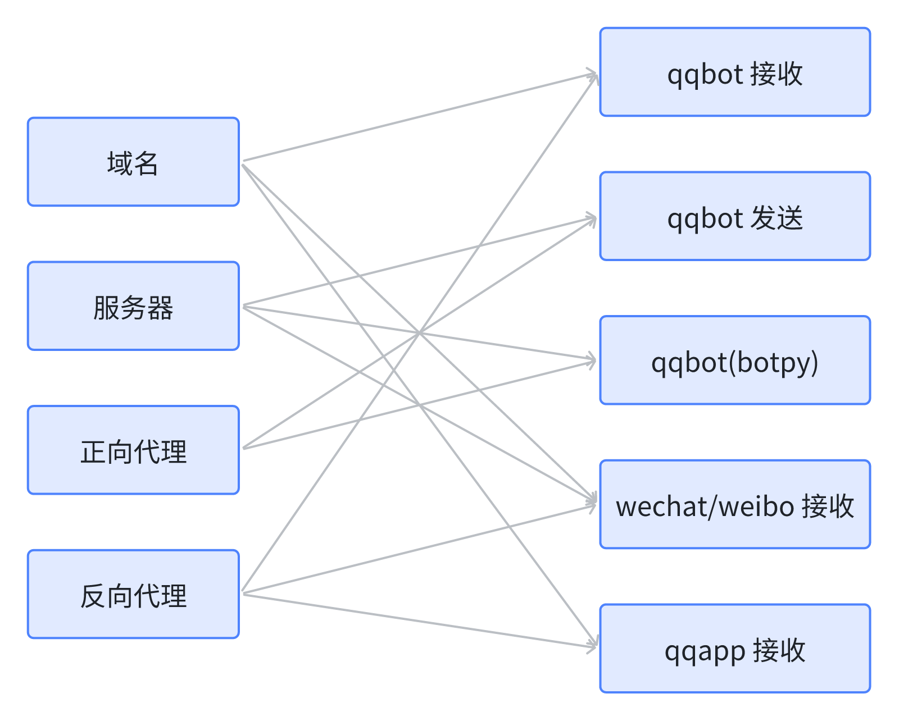
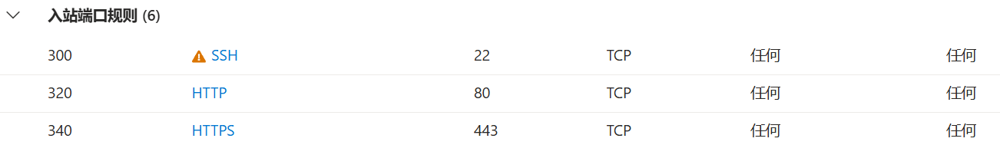

**切记不要随意公布你的服务器 ip**
## 各平台连接方式及需求
- 其中 napcat 是基于本地的 http 协议推送和调用，B 站是基于浏览器 cookie 的 api 调用，均不涉及 ip/域名配置

|   平台   |         qqbot         | qqbot(botpy方式) |      微信公众号       |        微博        |         QQ小程序         |
|:------:|:---------------------:|:--------------:|:----------------:|:----------------:|:---------------------:|
|  连接协议  |         https         |   websocket    |       http       |       http       |         https         | 
| 消息接收方式 |   主动推送到对应 ip(https)   |   websocket    | 主动推送到对应 ip(http) | 主动推送到对应 ip(http) | request 请求(https)(域名) | 
| 消息发送方式 |    白名单 ip 调用对应 api    |   websocket    |     调用对应 api     |     调用对应 api     |     request 请求返回      |
|   需求   | 支持 https 的域名，公网 ip 发送 |  公网 ip 接收及发送   |   支持 http 的 ip   |   支持 http 的 ip   |     支持 https 的域名      |



#### 配置总结
- 运行所有服务需要正向代理 + 反向代理 + 域名 + 备案
- 没有域名无法运行 qqbot 和 qqapp
- 没有备案域名无法运行 qqapp
- 考虑到校园网络环境，本项目中正向代理选择服务器+socks 的方法，反向代理选择服务器+nginx 的方法
- 本项目中服务器 ip 可随时更换（只需要更改域名解析即可）
- 其他正向及反向代理方法可参考部署说明后的结尾部分

## 名称解释
#### ip 与域名
- ip 包括服务器 ip (纯数字)和域名(字母)
- 域名是通过 DNS 解析成 ip 的

#### 协议
- 协议：传输层 tcp/udp，应用层 http/https/websocket
- 连接方式：（基于 tcp 协议）http1.0/http1.1/websocket
- 消息收发方式：单向 request+response / webhook，双向 websocket
- http 和 https 是两种不同的协议，分别关联服务器的 80 端口和 443 端口，https 需要证书

#### 证书
- SSL 证书是一种数字证书，用于在客户端和服务器之间建立安全的加密通信通道
- 多个地方可以提供证书，腾讯提供收费和免费的证书，cloudflare、Let's Encrypt 提供免费的证书

#### 备案
- 备案指所有国内的域名必须在 ICP 管理局进行备案，由于 QQ 小程序在今年年初停止了网址代备案服务，所以所有域名只能在服务器提供商处备案
- 国内的域名使用需要备案，国外的域名使用不需要备案

#### 域名解析
- 域名必须要有一个域名托管处（DNS 解析跳转的地方）
- 免费的域名不提供托管服务，可以使用 cloudflare 进行免费托管；收费的域名一般是域名提供商提供托管服务
- 域名托管服务器会根据记录将域名请求转发到你的服务器上
- 国内的服务器无法解析国外的域名（仅针对国内大企业服务器提供商），只能解析国内域名（且需要审核）；国内小厂服务器可解析所有域名（但非常容易跑路）；国外的服务器可以解析国外及国内的域名
- A 记录：将域名解析成一个 ipv4 地址；CNAME 记录：将你的域名解析成另一个域名；DS 记录：包含一个哈希值，用于验证 DNS 区域中下级区域的密钥
- 子记录：域名下的子域记录。*：所有未明确指定的子域名都会被解析到这个 IP 地址；www：www.xxxxxxx 会被解析到这个 IP 地址；域名本身： 仅域名本身会被解析到这个 IP 地址

#### 服务器正向代理
- 正向代理（一般叫做代理）指的是客户端通过代理服务器访问目标服务器
- 服务器连接命令中的 `-D 5923` 就是一种采用 socks5 的正向代理，把 5923 端口的请求转发到服务器
- 为什么不用 socks 而用 socks5？在测试 socks 代理时，使用 `nslookup  http://ifconfig.me`返回服务器 unknown，与网关有关，必须用 sock 强制在服务器上解析地址，--socks5 会报错而 --socks5-hostname不会

#### 服务器反向代理
- 反向代理指的是服务器在接收到客户端请求后，将请求转发给真实的服务器，并将服务器的响应返回给客户端
- 服务器连接命令中的 `-R localhost:10000:localhost:5922` 就是将本地的 5922 端口绑定到服务器的 10000 端口
- 同时配置 nginx 将 10000 端口转发到 80 端口和 443 端口，实现反向代理

## 价格和配置参考
- 国内的域名大部分都收费，国外的域名有大型的免费域名提供商；国内的服务器试用期只有 1-3 月，国外的服务器试用期大多为 1 年（但需要 visa 卡），国内小厂服务器极其不稳定
- 国内域名中，阿里价格最便宜，新用户[参考](https://t.aliyun.com/U/urbXTG)可获得 79/年的服务器，域名在 169/年左右；腾讯的其次，368/三年的服务器+109/三年的域名
- 国外的微软的云服务价格大致为 22 元/月，一年 264 元。 

## 服务器配置
- 由于 qqapp 的备案限制，本项目选择国内的服务器+国内的域名

#### 腾讯云域名+服务器购买
- 进入[优惠页面](https://cloud.tencent.com/act/pro/lighthouse2021)，选择轻量应用服务器，参考价格 368/三年
- 实名后选择域名，购买域名，参考价格 109/三年
- 选择右上角的备案，进行备案
- 备案完成后，进入控制台，搜索 SSL 证书，选择申请免费证书，选择自动DNS验证
- 进入控制台，选择轻量应用型服务器，SSH 密钥-创建密钥，绑定实例-同意强制关机-继续，私钥会自动下载
- 管理域名-添加域名解析-勾选前两个，第三个输入*，确认

#### 服务器连接
- 使用`ssh -i xxx\lrobot.pem username@ip`连接服务器（记得替换命令中的密钥文件路径、管理员名称和服务器ip）(腾讯管理员名称一般是ubuntu)
- `Are you sure you want to continue connecting (yes/no/[fingerprint])?` 选择yes
- 如果出现`Connection closed by xxx port 22`检查密钥路径以及是否开启了网络代理服务
- 在使用代理时，可能会出现以下情况：Invalid user dnsmasq from xxxxxx port 33570，dnsmasq 是使用代理后被更改的用户名，需要关闭代理
- 在同一电脑向服务器建立两个 ssh 连接时，如果开启 debug，有时会发现卡在 debug1: pledge: network，没找到解决方法，可能是服务器无法处理两个 ssh 连接的问题，使用清理 btmp 文件、禁用DNS解析、重启 systemd-logind 服务三种方法，均未解决

#### 服务器端口
- 为满足连接需要，22 端口（ssh 连接）是需要开启的
- 测试时，最好能开启 80 及 443 端口，以便直接通过服务器 ip 来测试
- 测试结束后，关闭服务器的 80 及 443 端口，后续都直接通过域名访问

#### nginx 配置/linux
- 参考[教程](https://www.cnblogs.com/orangebooks/p/12058830.html)或下文的安装命令在服务器上配置 nginx
- nginx 安装命令参考:
```
cd /opt
sudo wget http://nginx.org/download/nginx-1.27.3.tar.gz
sudo tar -zxvf nginx-1.27.3.tar.gz -C /usr/local
cd /usr/local/nginx-1.27.3
sudo apt-get update
sudo apt-get install -y zlib1g-dev libpcre3 libpcre3-dev build-essential libssl-dev certbot python3-certbot-nginx
sudo ./configure --with-http_v2_module --with-http_ssl_module
sudo make 
sudo make install
```
- 启动 nginx 服务 `cd /usr/local/nginx/sbin/` `sudo ./nginx`(此步骤失败参考端口占用)
- 将腾讯云下发的证书拷贝到服务器路径 `/etc/nginx/ssl/whumystery.cn_bundle.pem` 和 `/etc/nginx/ssl/whumystery.cn.key` 处，参考`ssh -i xx\lrobot.pem username@ip "sudo mkdir -p /etc/nginx/ssl/ && sudo chown username:username /etc/nginx/ssl/` `scp -i xx\lrobot.pem" "xx\whumystery.cn_bundle.pem" username@ip:/etc/nginx/ssl/`，记得*配置自动续费*
- 修改 nginx 配置，在本地创建一个 nginx.conf，在本地命令行使用命令`type xxxx\nginx.conf | ssh -i xxx\lrobot.pem username@ip "sudo tee /usr/local/nginx/conf/nginx.conf > /dev/null"`来更改服务器上的 nginx 配置文件（记得替换nginx文件路径、密钥文件路径、管理员名称和服务器ip），随后通过ssh连接服务器，输入`cd /usr/local/nginx/sbin``` ```sudo ./nginx -s reload`来重启nginx服务

#### nginx 配置/windows
- **注意 windows 版本，windows在2016 以上才能安装openssh**
- 访问 https://nginx.org/en/download.html 下载 nginx
- 打开 nginx/conf/nginx.conf 复制本地文件 nginx.conf
- 同样复制密钥文件（需要修改 nginx.conf 中密钥文件路径为 windows 上的路径）

#### 端口占用
`sudo netstat -tulnp | grep :80`
`sudo kill -9 1234`(占用进程的id)
#### 调试
- 当 ssh 测试出现错误时可按照此步骤逐步排除配置错误
- 本地运行后端代码（自行配置或者新建pem_test,py，复制）
```
from fastapi import FastAPI, Response
app = FastAPI()
@app.get("/test")
def read_test():
    return Response(content="Hello World!", media_type="text/plain")
if __name__ == "__main__":
    import uvicorn
    uvicorn.run(app, host="0.0.0.0", port=5922)
```
- 访问 127.0.0.1:5922/test 成功返回 Hello World!
- 命令行 1 使用 `ssh -i xxx\lrobot.pem username@ip`测试连接，命令行进入 linux 界面
- 命令行 2 使用 `ssh -i xxx\lrobot.pem -v -N -R 10000:localhost:5922 username@ip` 显示 remote forward success 即为监听成功
- 命令行 1 分别用 `curl http://localhost:10000/test` 和 `curl http://localhost:80/test` 测试端口是否转发成功、服务器是否配置成功
- 访问 服务器/test, 域名/test 测试反向代理、域名代理是否成功（如果服务器未开启 80/443 端口则不用测试服务器）
- 关闭命令行 2，命令行 3 使用`ssh -v -N -D 5923 -i xxx\lrobot.pem username@ip` 显示 `Remote: /home/lrobot/.ssh/authorized_keys:1: key options: agent-forwarding port-forwarding pty user-rc x11-forwarding` 即为转发成功
- 命令行 1 使用 `sudo nano /etc/ssh/sshd_config` ，设置 AllowTcpForwarding yes、PermitTunnel yes、GatewayPorts no,重启服务 `sudo systemctl restart ssh`
- 命令行 4 使用 `curl -v --socks5-hostname 127.0.0.1:5923 http://ifconfig.me` 成功返回地址
- 若上一步错误，服务器（命令行 1）测试`curl http://ifconfig.me`返回地址，`ssh -D 5923 localhost`接着`curl -v --socks5 127.0.0.1:5923 http://ifconfig.me` 正确返回服务器地址，则服务器本身配置正确
- 端口被占用：ssh 未正常关闭时发生，显示`Remote: Forwarding listen address "localhost" overridden by server GatewayPorts`，需要使用`sudo ss -lpn | grep :10000`以及`sudo kill -9 {pid}`来杀死进程
- 关于上一步，已在 command 里面实现自动杀死进程

## 其他
#### 免费域名+服务器申请
- 如果不使用 qqapp，可以申请国外的免费域名+服务器试用
- 创建一个域名，以 cloudDNS 为例，进入[官网](https://www.cloudns.net/)，注册帐号并在邮箱激活
- 返回官网，选择是，跳转到 DNS 区域创建页面，在 DNS 托管中选择创建区域-自由区，创建域名
- 删除域名网站的域名下所有记录，选择添加新记录
- 进入 [CloudFlare](https://dash.cloudflare.com/17fe62bb580cfd910624a470ce4a3d14/home/domains) 并注册帐号，选择添加站点，输入你的域名
- 选择 Free 计划并确认，选择继续，在更新名称服务器下面有两个名称服务器网址，复制
- 复制后回到域名网站，添加新记录，选择 NS，指向到粘贴名称服务器网址，其他不用填。重复两次
- 等待 cloudFlare 向你发送邮件，域名托管成功
- 创建一个服务器，以 [Azure](https://azure.microsoft.com/zh-cn/free/) 为例，填写手机以及信用卡号（**一定要有visa卡**），注册成功（可以用微软帐号登录，也需要验证手机号和卡号）
- 选择免费服务，创建 Linux 虚拟机，输入名称，选择地区（(Asia Pacific) East Asia 应该是香港，最快），大小选择 B1s（免费服务应该只有 B1s），设置用户名，SSH 选择生成新密钥对，设置密钥对名称为 lrobot，选择查看+创建，选择下载密钥对并创建资源
- 选择转到资源，点击概述里的公共 ip 地址，跳转到 lrobot-ip 配置，选择设置-配置，IP 地址分配选择静态，点击保存
- 回到 lrobot，选择网络-网络配置，创建端口规则-入站端口规则，服务分别选择 HTTP 和 HTTPS，点击添加 
- 如果没有免费服务，可以选择购买服务器。
- 务必选择对应的域名和服务器，国外的域名对应国外的服务器，国内的域名对应国内的服务器
- 在 cloudDNS 官网上添加三条 A 记录，类型选择 A，指向到输入服务器公共 ip 地址，主机分别填写 （不填）、*、www （三条 A 记录放在 cloudFlare 上托管也行）
- 本项目在配置 cloudflare 经常遇到无法转发的错误，所以使用 nginx 的 https 配置以及 Let's Encrypt 证书
- nginx 配置与上文相同，配置完成后，配置 Let's Encrypt SSL 证书与自动续期：`sudo pkill nginx` `sudo certbot certonly --nginx -d 域名` `sudo certbot renew --dry-run` `sudo crontab -e`在末尾添加`0 3 * * * certbot renew --quiet --post-hook "systemctl reload nginx"` 使用 ctrl+x 并输入 :qa 退出 `cd /usr/local/nginx/sbin/``` ```sudo ./nginx`
- windows 中配置证书的操作为：访问 https://www.win-acme.com/ 下载 acme，运行 wacs，输入 n，2，域名，3，n，y，邮箱，成功配置，手动配置密钥生成路径 `wacs.exe --target manual --host 域名 --store pemfiles --pemfilespath "C:\path\to\your\certs"`，需要每隔三个月运行 wacs.exe --renew 进行更新或者手动更新

#### 其他正反向代理方法
#### clash
- 如果采用正向代理，下载 clash，自己获取一个机场，项目运行时开启 TUN 模式即可
- TUN 模式：模拟网络层设备，新建一个 TUN 虚拟网卡实现 DNS 劫持
- 服务模式：支持 TUN 模式，重启clash并在系统中创建一个服务管理网卡
- TAP 模式：模拟数据链路层设备，操作以太网帧
- 系统代理：配置系统中的代理，对于浏览器适用，对于其他软件可能不适用
- 可以设置一个长期的稳定 ip 针对 qq 服务器的消息转发，配置为：
```
proxies:
  - {name: xxx, server: xxx, port: 39091, type: ssr, cipher: chacha20-ietf, password: xxx, protocol: xxx, obfs: xxx, udp: true
rules:
  - DOMAIN-SUFFIX,sgroup.qq.com,xx
  - MATCH,DIRECT
```

#### [小米球](https://www.xiaomiqiu.cn/)
- 小米球使用 ngrok 服务让本地项目支持外网访问，可以自己申请[隧道](https://manager.xiaomiqiu.com/login)
- 申请好后将地址和密码写入 xiaomiqiu.conf 中，将小米球文件夹放在 lrobot 同级目录中
- 之后在 main 里面的 tasks 增加一项：run_xiaomiqiu()，如果需要日志格式转化则参考 abandoned/service.py 里的方式

#### 其他失败的方法
- 用 cloudflare 里的 zerotrust 的本地隧道穿透测试失败，能显示访问请求且结果为 NOERROR,tunnel 配置和 DNS 配置都是正常的,可能与网络有关
- DDNS-GO 可用于不存在网关的网络系统中。对于家庭组网路由，ipv4 和网关的 ipv4 相同，动态 DDNS 解析没有用，本质上还是获取你的固定的 ipv4 上报到类似于 cloudflared 的域名解析平台，访问提交给网关时，无法正确定位到你的电脑上
- 如果网关不是光猫而是路由器直接连接网线，可以尝试配置路由器分配固定 ip 的方法，即配置路由器某端口固定返回本机。光猫网关不支持分配端口
- 使用 ipv6 也许是可行的，但 Hurricane Electric 的 6in4 注册不了，可能是网络问题

#### 相关问题
- 当使用校园网的时候，通过 ipconfig 获取的 ip *理应* 是你的真实 ip，但把此 ip 加入 qq 的白名单后却无法建立 ws 连接，推测跟连接时的转发机制有关，网关不会将请求直接映射到你的电脑上
- 当使用 socks5 的时候，将服务器 ip 加入白名单，向 qq 服务器建立 ws 连接，会连接失败，强制识别你的本机 ip（原理未知）
- 关于上一点，使用了查看 dns 解析、更改 aiohttp.session[方法](../abandoned/aiohttp_test.py)，更换 connector 的方法后，访问 ipconfig 返回的都是服务器的 ip;通过抓包工具（wireshark 和 tcpdump 监听）分析也是经过服务器转发的；请求头在本地打印后是空的，抓包的话需要解密。经过解析，可能需要启动 SNAT 技术来更改 websocket 请求中的源 ip 地址信息，clash 使用了 MASQUERADE（动态snat）来完成。
- 当使用 clash 的 TUN 模式时，由于是模拟网络层而不是应用层，可以绕开 ws 连接携带 ip 的限制（猜测），把代理服务器加入白名单后即可正确连接 qq
- 有时候会出现 uvicorn 服务在 0.0.0.0 无法访问的问题，解答可能是本地防火墙或安全组规则可能阻止了 127.0.0.1 的访问权限（尽管此情况较罕见）
