## grafana 系列服务配置指南
- 从 grafana [官网](https://grafana.com/zh-cn/grafana/?pg=graf&plcmt=hero-btn-1#grafana-versions)下载 grafana，如要更改端口则修改 conf/defaults.ini 的 http_port = 5930
- 从 prometheus [官网](https://prometheus.io/download/)下载 prometheus
- 配置 prometheus.yml
```
global:
  scrape_interval: 15s
  evaluation_interval: 15s

scrape_configs:
  - job_name: "prometheus"
    static_configs:
      - targets: ["localhost:5926"]
  - job_name: "windows_exporter"
    static_configs:
        - targets: ["localhost:5924"]
  - job_name: "application_metrics"
    static_configs:
        - targets: [ "localhost:5925" ]
```
- 新建 prometheus.bat `prometheus.exe --config.file=prometheus.yml --web.listen-address=":5926"`
- 需要在本地的 5923 配置一个 ws 连接，定时发送 SERVICE_STATUS（定义的 prometheus 指标），接收 grafana 的后端返回结果
- 从 windows-exporter [官网](https://github.com/prometheus-community/windows_exporter/releases)下载 windows-exporter
- 配置 windows-exporter.yml
```
collectors:
  enabled: cpu,cs,logical_disk,net,os,service,system
collector:
  service:
    include: "windows_exporter"
  scheduled_task:
    include: /Microsoft/.+
log:
  level: debug
scrape:
  timeout-margin: 0.5
telemetry:
  path: /metrics
  max-requests: 5
web:
  listen-address: ":5924"
```
- 新建 windows-exporter.bat `windows_exporter-0.30.0-beta.4-amd64.exe --config.file="windows_exporter.yml"`
- 访问 http://localhost:5926 ，访问http://localhost:5924/metrics 确认 windows-exporter 启动，配置 rate(interface_tx_bytes_total)
- 从 loki [官网](https://github.com/grafana/loki/releases)下载 loki
- 配置 loki.yml
```
auth_enabled: false

server:
  http_listen_port: 5927
  log_level: info

common:
  ring:
    instance_addr: 127.0.0.1
    kvstore:
      store: inmemory
  replication_factor: 1
  path_prefix: loki

schema_config:
  configs:
  - from: 2020-05-15
    store: tsdb
    object_store: filesystem
    schema: v13
    index:
      prefix: index_
      period: 24h

storage_config:
  filesystem:
    directory: chunks
```
- 新建 loki.bat `@echo off \n chcp 65001 \n loki-windows-amd64.exe -config.file=loki.yml`
- 从 loki [官网](https://github.com/grafana/loki/releases)下载 promtail
- 配置 promtail.yml
```
server:
  http_listen_port: 5928
  grpc_listen_port: 0
positions:
  filename: positions.yaml
clients:
  - url: http://localhost:5927/loki/api/v1/push
scrape_configs:
- job_name: service_logs
  static_configs:
  - targets:
      - localhost
    labels:
      job: service_logs
      __path__: ../service.log
  pipeline_stages:
    - json:
        expressions:
          level: level
          time: time
          service: service  # 从日志内容中提取 service 字段作为标签
          message: message
    - labels:
        level: level
        time: time
        service: service  # 从日志内容中提取 service 字段作为标签
        message: message
- job_name: robot_logs
  static_configs:
  - targets:
      - localhost
    labels:
      job: robot_logs
      __path__: ../robot.log
  pipeline_stages:
    - json:
        expressions:
          level: level
          time: time
          robot: robot
          event: event
          command: command
          target: target
          message: message
    - labels:
        level: level
        time: time
        robot: robot
        event: event
        command: command
        target: target
        message: message
```
- 新建 promtail.bat `@echo off \n chcp 65001 \n promtail-windows-amd64.exe -config.file=promtail.yml`
- 安装包 `pip install prometheus_client`，将 [service.py](../abandoned/service.py)里的 start_services(),monitor_services() 和 stop_services()分别放在 main 里面的 start、tasks、stop 中，将最后面的 filter 移动至 log.py，运行
- 以上所有文件夹都放置在 lrobot 同级位置
- 访问 http://localhost:3000 ，settings-data sources-add data source，选择 Prometheus 和 Loki，地址分别为 http://localhost:5926 和 http://localhost:5927
- 在仪表盘中根据 windows-exporter 配置上下行网速；设置 loki 查询面板，根据 level 和 robot 筛选；使用 web 组件与 5923 端口通信，实现指标的展示与反馈

## 日志格式
- 以下为自启动与代码启动的日志对比，日志格式转化可以在[service.py](./abandoned/service.py)中找到
#### napcat
- 自启动 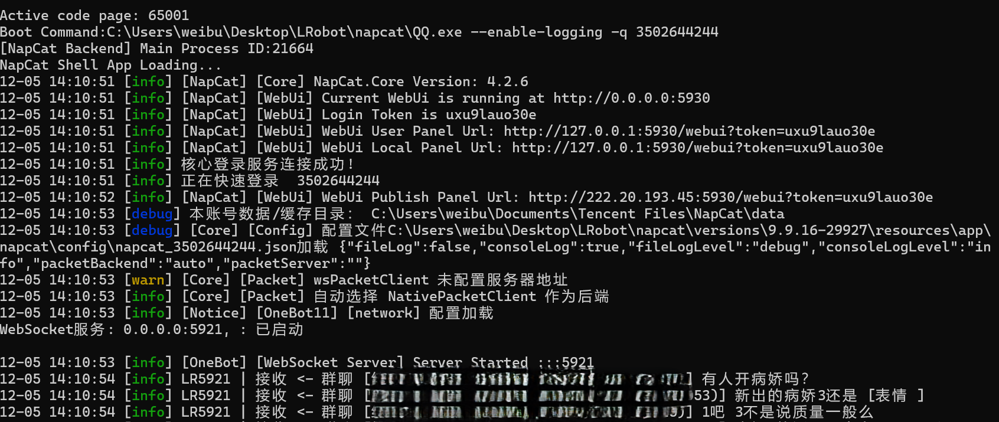
- 代码启动 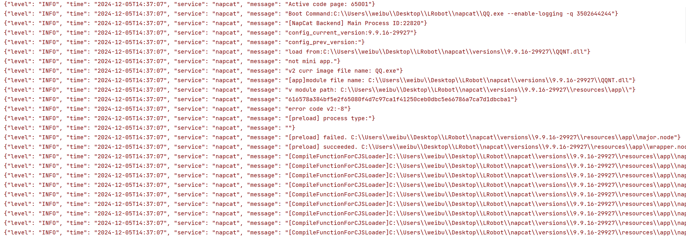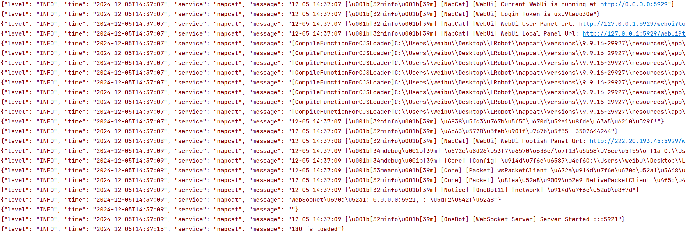
- 代码启动会多出很多可能是 node.js 里面出现而在控制台里不出现的内容，所以把这些以"[]"开头的内容简单地识别进debug里（包括会在控制台里出现的```[NapCat Backend] Main Process ID:22820```）启动的 qq 进程 id
- 断网后会显示:12-05 14:51:56 [info] LR5921 | 账号状态变更为离线
- 错误（warn）的测试还没有找到，等待发送消息流程搭建完成后测试
- *修改后输出相同的日志，除了从```[NapCat Backend]``` 到```NapCat Shell App Loading...```中间的8行仍然保留*
- *修改后可以识别中文*
- *修改后忽略了 active 那一句*

#### xiaomiqiu
- 自启动 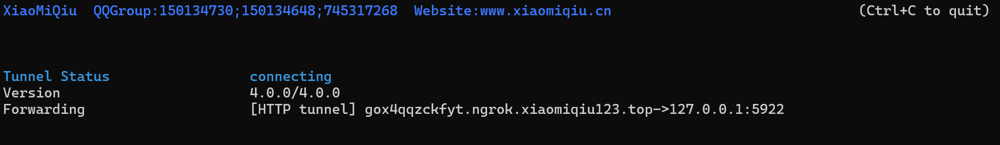
- 自启动会显示一个状态表，正常是 connect，断网后是 connecting
- 正常启动的输出只有几行 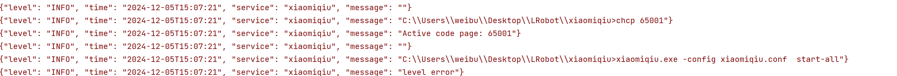，即使用跟 loki 一样的重定向方法，内部输出语句的优先级仍然高于控制台，会输出到最新日志的文件夹里
- 日志输出 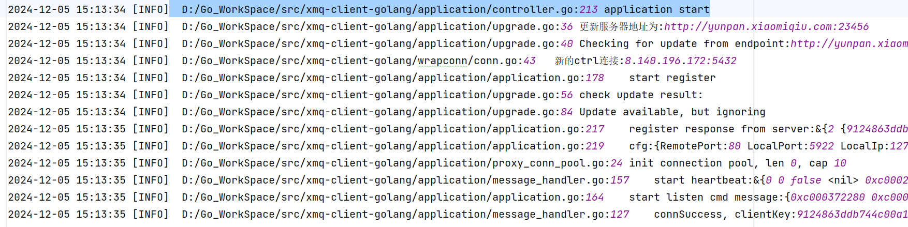
- 修改后代码启动 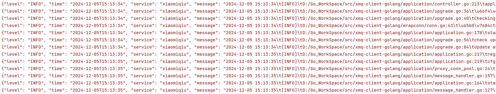
- 但当断网时不会把日志等级设为 error，需要在 log 里增加判断 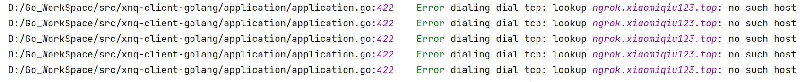
- 断网时启动会直接设为 error
- 另外，这个也是 go 语言
- *修改后简化了正则表达式*
- *修改后支持识别中文*

#### windows_exporter
- 日志较少，自启动时仅仅有几条日志，然后访问 /metrics 或 /health 时只会有几条debug 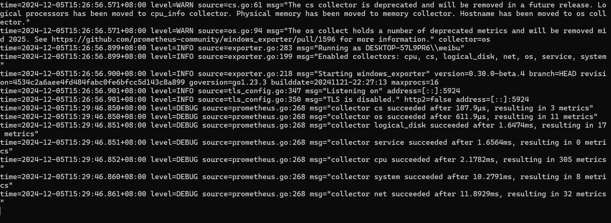
- 当端口被占用时程序会直接终止且没有任何日志，需要靠 monitor 去发现
- 并且这个也是 go，并且创建文件比 loki 慢，loki 启动非常快导致日志文件必须从开头读，这个启动非常慢导致1.必须结束后删除日志文件2.必须循环等待日志文件读取
- 调试完成后日志（控制台相同） 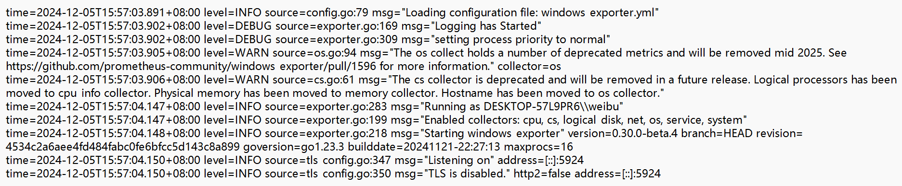

#### prometheus
- 自启动 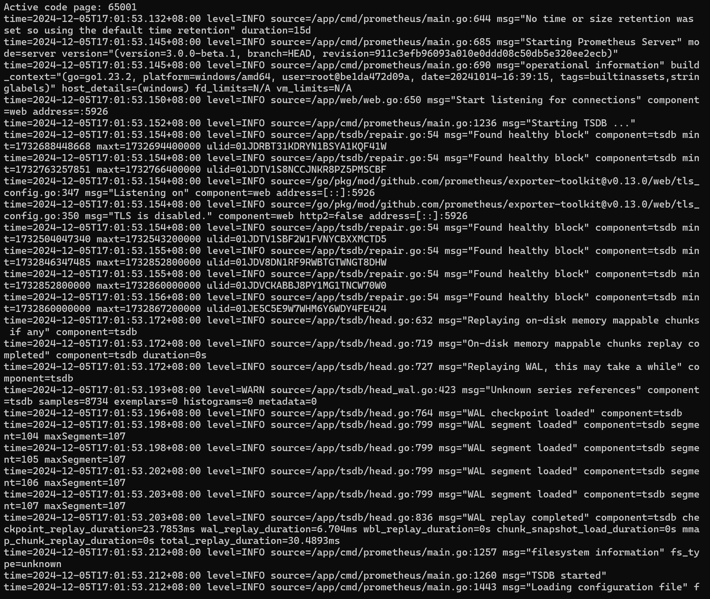
- 代码启动 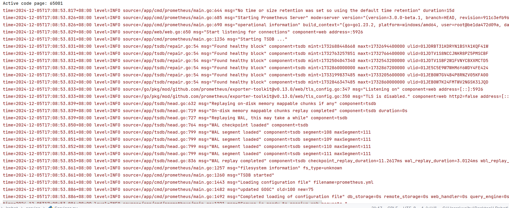
- 在处理 Prometheus 输出的时候发现只需要 asyncio.create_subprocess_shell 里面不加 pipe 捕获，就可以正常输出（但不能捕获） windows_exporter 的所有日志，故删除了之前的逻辑
- 然后发现 napcat 输出不加 pipe 捕获，就捕获不了日志而是直接输出到控制台
- 然后换 ai 重构了代码

#### grafana
- 自启动 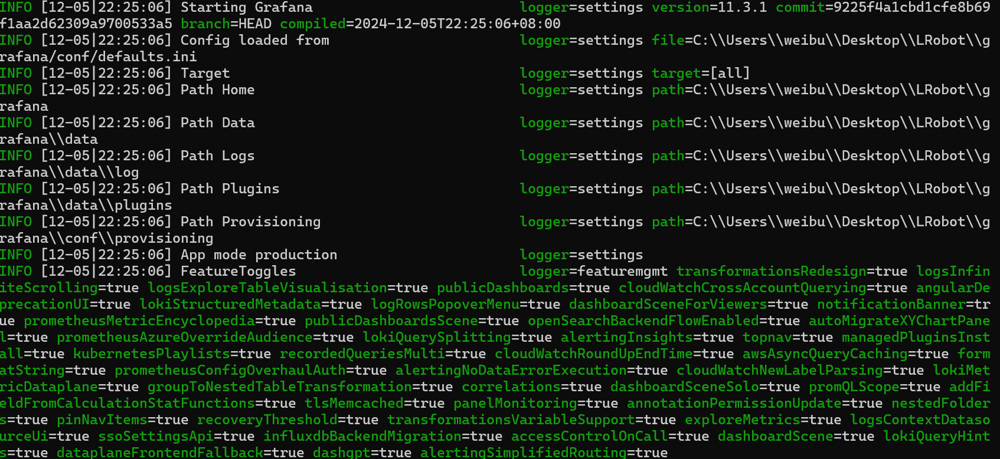
- 代码启动 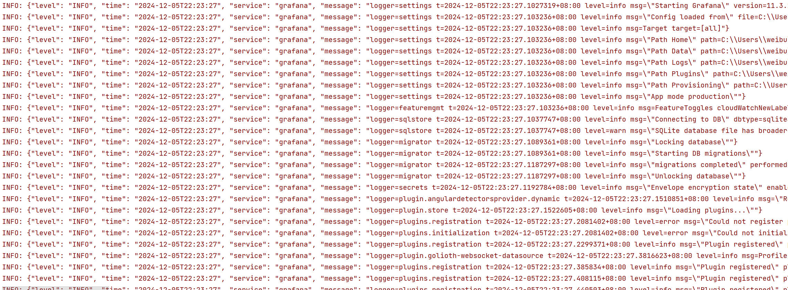
- 基本一样，但自启动有特殊格式

#### loki
- 自启动(比较慢) 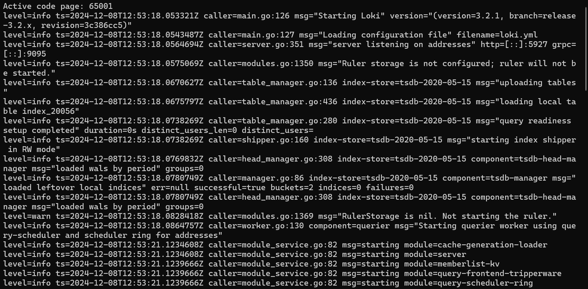
- 代码启动 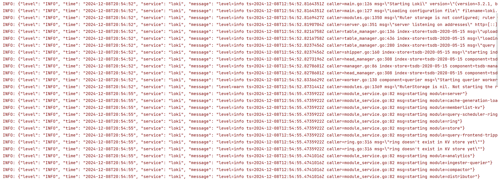
- 一样的，启动比较慢，然后可以使用 `netstat -ano | findstr :5927和tasklist | findstr 19528`来查看 loki 是否正常关闭（会过一会关闭），http://localhost:5927/metrics 和 http://localhost:5927/ready 都可以访问
- 在日志归类时发现了 loki 存在一些不含 msg 的日志：```level=info ts=2024-12-09T08:03:21.0071912Z caller=metrics.go:386 org_id=fake traceID=400f7ba8831fd4c3 latency=fast query_type=stats start=2024-12-09T09:58:19+08:00 end=2024-12-09T09:59:30+08:00 start_delta=6h5m2.0071912s end_delta=6h3m51.0071912s length=1m11s duration=1.0007ms status=200 query=\"{job=\\\"logs\\\", service=~\\\"grafana\\\", level=~\\\".*\\\"}\" query_hash=3442096169 total_entries=1```
- 故把 caller 后面的全部作为 msg 消息提取

#### promtail
- 自启动 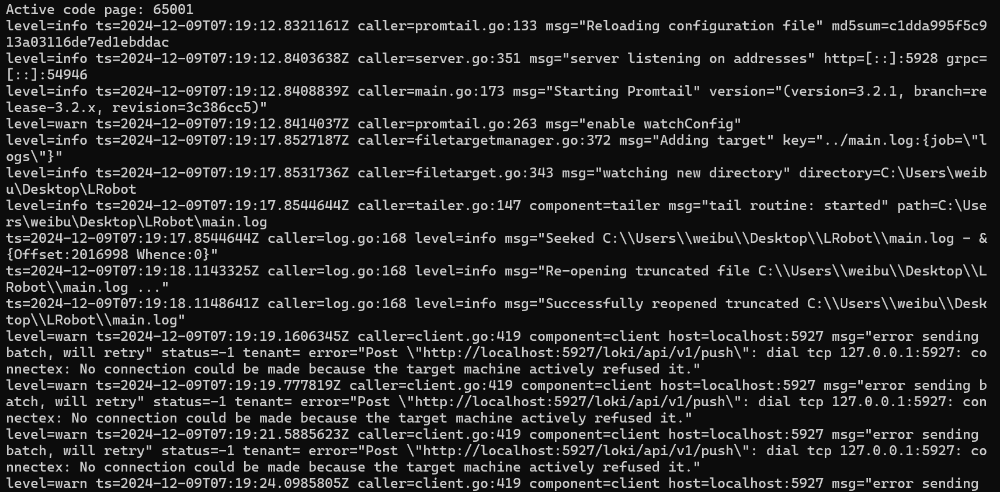
- 代码启动 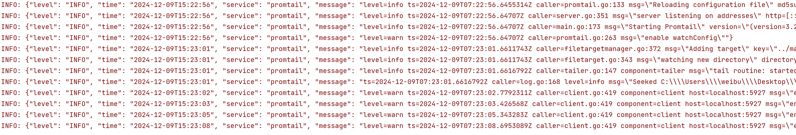
- 单独启动 promtail，不启动 loki 时会一直尝试往loki发送消息
